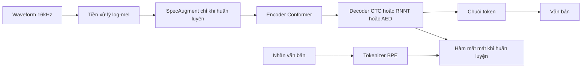

# 01 — Toàn cảnh pipeline ASR

Bản đồ end-to-end của một hệ ASR theo kiến trúc model VPB (Fast-Conformer RNNT BPE), định vị chín thành phần sẽ đào sâu ở các file con.

---

## Glossary

- **Pipeline** — chuỗi các bước biến đổi dữ liệu từ đầu vào tới đầu ra.
- **Encoder** — phần biến đặc trưng âm thanh thành biểu diễn ẩn.
- **Decoder** — phần sinh chuỗi token từ biểu diễn ẩn.
- **Token** — đơn vị văn bản sau khi tách bằng tokenizer.
- **log-mel** — đặc trưng phổ tần số theo thang mel, lấy logarit.

---

## 1. Hai chế độ: huấn luyện và suy luận

- **Huấn luyện (training)** — có nhãn văn bản; tính hàm mất mát giữa dự đoán và nhãn để cập nhật trọng số.
- **Suy luận (inference)** — không có nhãn; chạy giải mã để ra văn bản dự đoán.
- **Khác biệt chính** — SpecAugment và hàm mất mát chỉ có khi huấn luyện; giải mã (greedy/beam) chỉ có khi suy luận.

---

## 2. Luồng dữ liệu end-to-end

---

## 3. Chín thành phần và vai trò

| Thành phần | Vai trò | File con |
| --- | --- | --- |
| Tokenizer | Văn bản ↔ token id | `02_tokenizer.md` |
| Tiền xử lý audio | Waveform → log-mel | `03_audio_to_mel.md` |
| SpecAugment | Che ngẫu nhiên log-mel khi huấn luyện | `04_specaugment.md` |
| Encoder Conformer | log-mel → biểu diễn ẩn | `05_encoder_conformer.md` |
| Giải mã CTC | Biểu diễn ẩn → token (căn chuỗi) | `06_decode_ctc.md` |
| Giải mã RNNT | Biểu diễn ẩn → token (model VPB) | `07_decode_rnnt.md` |
| Giải mã AED | Biểu diễn ẩn → token (encoder–decoder) | `08_decode_aed.md` |
| Đánh giá WER | So sánh dự đoán với nhãn | `09_evaluation_wer.md` |

---

## 4. Bảng input/output từng mắt xích (model VPB)

| Mắt xích | Input | Output |
| --- | --- | --- |
| Tiền xử lý | Waveform `[B, T]` float32 | log-mel `[B, 80, T2]` |
| Encoder | log-mel `[B, 80, T2]` | biểu diễn ẩn `[B, 512, T3]` (T3 ≈ T2/8) |
| Decoder + Joint | encoder out + token trước đó | logits trên vocab `[..., 1025]` |
| Giải mã | logits | chuỗi token id |
| Tokenizer (giải mã ngược) | token id | văn bản |

- **Lưu ý** — vocab model VPB là 1024 token cộng một token blank, nên đầu ra joint có 1025 chiều.

---

## ✅ Tự kiểm nhanh

1. Thành phần nào chỉ xuất hiện khi huấn luyện, không có khi suy luận?

Đáp án

SpecAugment và hàm mất mát. Tokenizer dùng để mã hóa nhãn khi huấn luyện và giải mã ngược khi suy luận.

2. Vì sao T3 nhỏ hơn T2 khoảng 8 lần?

Đáp án

Do lớp subsampling trong encoder hạ tần số lấy mẫu 8× (đặc trưng Fast-Conformer), giảm độ dài chuỗi thời gian để tính nhanh hơn.

