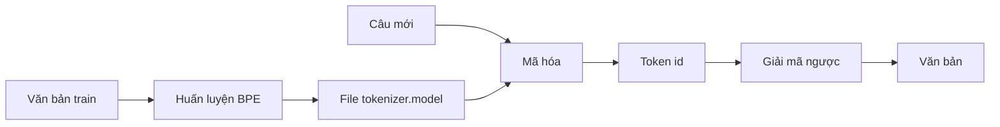

# 02 — Tokenizer (SentencePiece BPE)

Thành phần chuyển đổi giữa văn bản và chuỗi token id; quyết định không gian đầu ra của model.

---

## Glossary

- **Token** — đơn vị văn bản dưới từ (subword), nhỏ hơn từ, lớn hơn ký tự.
- **BPE** — Byte Pair Encoding: thuật toán gộp dần các cặp ký tự/đơn vị hay đi cùng nhau.
- **SentencePiece** — thư viện huấn luyện tokenizer dưới từ trực tiếp từ văn bản thô.
- **vocab** — tập toàn bộ token, kích thước cố định.
- **OOV** — Out-Of-Vocabulary: đơn vị không có trong vocab.

---

## 1. Vai trò

- Mã hóa nhãn văn bản thành token id để tính hàm mất mát khi huấn luyện.
- Giải mã ngược token id của model thành văn bản khi suy luận.
- Neo mã nguồn — `nemo/collections/common/tokenizers/sentencepiece_tokenizer.py`; cấu hình `model.tokenizer` trong config (`type: bpe`).

---

## 2. Input và output

- **Input (mã hóa)** — chuỗi ký tự văn bản, ví dụ "phải chị ơi".
- **Output (mã hóa)** — danh sách token id, ví dụ `[57, 812, 9, ...]`.
- **Chiều ngược lại** — danh sách token id → văn bản.

---

## 3. Bộ xử lý ở giữa

- **Huấn luyện tokenizer** — đọc toàn bộ văn bản trong train manifest, gom thống kê, học bộ token theo BPE; xuất file `tokenizer.model`.
- **Tham số chính** — `vocab_size` (model VPB dùng 256, 512, và bản cuối 1024).
- **Token đặc biệt** — với RNNT có thêm token blank đặt ở chỉ số bằng `vocab_size` (model VPB: `blank_id = 1024`).
- **Công cụ** — `scripts/tokenizers/process_asr_text_tokenizer.py`.

---

## 4. Flow

---

## 5. Độ phức tạp

- **Mã hóa/giải mã** — tuyến tính theo độ dài câu.
- **Đánh đổi vocab** — vocab nhỏ thì chuỗi token dài hơn (tính chậm hơn) nhưng ít OOV; vocab lớn thì chuỗi ngắn nhưng cần nhiều dữ liệu để học token hiếm.

---

## 6. Cách đánh giá chất lượng

- **Tỉ lệ token trên ký tự** — đo độ nén của tokenizer.
- **Tỉ lệ OOV / fallback về ký tự** — đo khả năng phủ từ vựng, quan trọng với callbot do nhiều tên riêng, số tiền, giọng địa phương.
- **Liên hệ thực tế** — issue mở rộng vocab cho từ ngoài miền được ghi trong `vpb_mod/TODO.md`.

---

## ✅ Tự kiểm nhanh

1. Vì sao RNNT cần token blank và nó đặt ở đâu?

Đáp án

Token blank cho phép model "không phát ra ký tự" tại một bước; đặt ở chỉ số bằng vocab_size (model VPB: 1024), nên không gian đầu ra là 1025.

2. Vocab nhỏ và vocab lớn đánh đổi điều gì?

Đáp án

Vocab nhỏ: chuỗi token dài hơn, tính chậm hơn, ít OOV. Vocab lớn: chuỗi ngắn hơn nhưng cần nhiều dữ liệu để học token hiếm.

