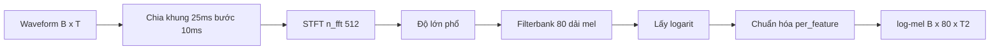

# 03 — Tiền xử lý audio: waveform sang log-mel

Thành phần biến tín hiệu âm thanh thô thành đặc trưng phổ mà encoder dùng làm đầu vào.

---

## Glossary

- **Waveform** — tín hiệu âm thanh theo thời gian, dãy số biên độ.
- **STFT** — Short-Time Fourier Transform: biến đổi Fourier theo từng cửa sổ ngắn.
- **mel** — thang tần số mô phỏng cảm nhận của tai người (dày ở tần thấp, thưa ở tần cao).
- **filterbank** — tập bộ lọc tam giác gộp phổ thành các dải mel.
- **frame / hop** — khung cửa sổ phân tích và bước nhảy giữa các khung.

---

## 1. Vai trò

- Biến waveform thành chuỗi vector đặc trưng theo thời gian (log-mel), giảm chiều và làm nổi cấu trúc tần số.
- Neo mã nguồn — `AudioToMelSpectrogramPreprocessor` (lớp con `FilterbankFeatures`), `nemo/collections/asr/modules/audio_preprocessing.py`.

---

## 2. Input và output

- **Input** — `input_signal` float32 `[B, T]` (T mẫu, ví dụ 24000 mẫu cho 1,5 giây ở 16kHz) và `length` int64 `[B]`.
- **Output** — `processed_signal` float32 `[B, 80, T2]` và `processed_signal_length` int64 `[B]`.
- **Ý nghĩa chiều** — 80 là số dải mel; T2 là số khung thời gian sau khi chia cửa sổ.

---

## 3. Bộ xử lý ở giữa (tham số model VPB)

- **sample_rate** — 16000 Hz.
- **window** — Hann, kích thước 25 ms (`window_size: 0.025`), bước nhảy 10 ms (`window_stride: 0.01`).
- **n_fft** — 512.
- **features** — 80 dải mel.
- **normalize** — `per_feature` (chuẩn hóa theo từng dải).
- **dither** — 1e-5 (thêm nhiễu rất nhỏ để ổn định số học).
- **Các bước** — chia khung → cửa sổ Hann → STFT → lấy độ lớn phổ → áp filterbank mel → lấy log → chuẩn hóa.

---

## 4. Flow

---

## 5. Độ phức tạp

- **STFT** — mỗi khung tốn theo n_fft·log(n_fft); tổng theo số khung.
- **Số khung T2** — xấp xỉ thời lượng chia bước nhảy 10 ms; ví dụ 1 giây cho khoảng 100 khung.
- **Bộ nhớ** — tuyến tính theo độ dài audio và batch.

---

## 6. Cách đánh giá chất lượng

- **Kiểm tra thống kê đặc trưng** — trung bình và phương sai sau chuẩn hóa nên ổn định quanh 0 và 1.
- **Khớp tham số train và infer** — sai số hệ thống xảy ra nếu lúc suy luận dùng sample_rate hoặc window khác lúc huấn luyện.
- **Liên hệ thực tế** — audio điện thoại có thể là 8kHz; cần resample về 16kHz trước, nếu không đặc trưng sẽ lệch.

---

## ✅ Tự kiểm nhanh

1. 80 và T2 trong output là gì?

Đáp án

80 là số dải mel (chiều đặc trưng); T2 là số khung thời gian, xấp xỉ thời lượng audio chia bước nhảy 10 ms.

2. Vì sao phải khớp sample_rate giữa huấn luyện và suy luận?

Đáp án

Vì đặc trưng log-mel phụ thuộc sample_rate và kích thước cửa sổ; lệch tham số làm đặc trưng lúc suy luận khác phân phối lúc huấn luyện, gây tăng lỗi.

