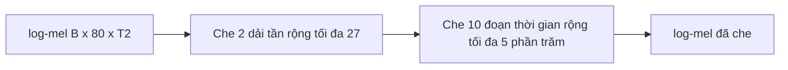

# 04 — SpecAugment (tăng cường dữ liệu)

Kỹ thuật che ngẫu nhiên một phần log-mel khi huấn luyện để model bớt phụ thuộc vào vùng cố định, tăng khả năng tổng quát hóa.

---

## Glossary

- **Augmentation** — tăng cường dữ liệu: tạo biến thể từ mẫu gốc để model học bền hơn.
- **mask** — vùng bị che (đặt về giá trị trung bình hoặc 0).
- **overfitting** — học thuộc dữ liệu huấn luyện, kém trên dữ liệu mới.

---

## 1. Vai trò

- Chỉ hoạt động khi huấn luyện; tắt khi suy luận.
- Giảm overfitting bằng cách buộc model không dựa vào một dải tần hay một đoạn thời gian cố định.
- Neo mã nguồn — `SpectrogramAugmentation`, `nemo/collections/asr/modules/audio_preprocessing.py`; cấu hình `model.spec_augment`.

---

## 2. Input và output

- **Input** — log-mel `[B, 80, T2]`.
- **Output** — log-mel cùng shape, một số dải tần và đoạn thời gian bị che.

---

## 3. Bộ xử lý ở giữa (tham số model VPB)

- **freq_masks** — 2 (số dải tần bị che mỗi mẫu).
- **freq_width** — 27 (độ rộng tối đa mỗi dải tần bị che).
- **time_masks** — 10 (số đoạn thời gian bị che).
- **time_width** — 0,05 (độ rộng theo tỉ lệ độ dài, tối đa 5%).
- **Cơ chế** — chọn ngẫu nhiên vị trí và độ rộng trong giới hạn trên, đặt vùng đó về giá trị che.

---

## 4. Flow

---

## 5. Độ phức tạp

- **Chi phí** — không đáng kể so với encoder; chỉ là thao tác gán giá trị trên tensor.
- **Ảnh hưởng** — không đổi shape, không thêm tham số.

---

## 6. Cách đánh giá chất lượng

- **So sánh có và không SpecAugment** — quan sát chênh lệch giữa lỗi trên tập train và tập validation.
- **Lưu ý ổn định** — giai đoạn đầu huấn luyện nếu không ổn định có thể tắt tạm (cờ `--disable-specaug` trong script VPB) rồi bật lại.

---

## ✅ Tự kiểm nhanh

1. SpecAugment hoạt động ở chế độ nào và nhằm mục đích gì?

Đáp án

Chỉ khi huấn luyện; nhằm giảm overfitting bằng cách che ngẫu nhiên dải tần và đoạn thời gian, buộc model không phụ thuộc vùng cố định.

2. SpecAugment có làm thay đổi shape hay thêm tham số không?

Đáp án

Không. Nó chỉ gán giá trị che lên tensor log-mel, giữ nguyên shape và không thêm tham số học.

