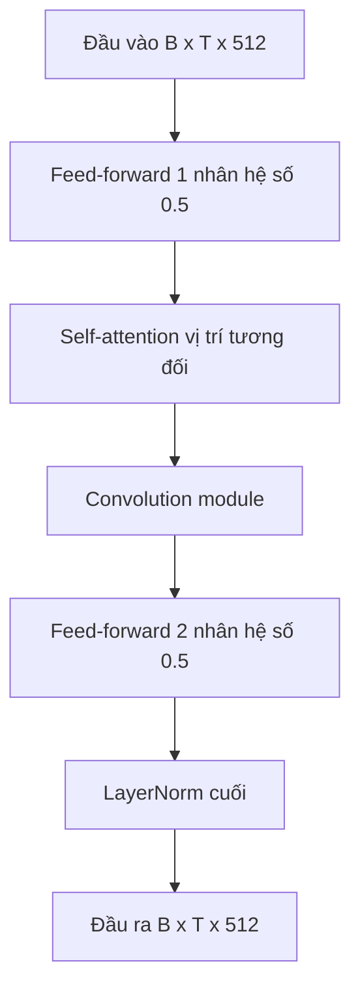

# 05 — Encoder Conformer / Fast-Conformer

Thành phần lõi của model: biến chuỗi log-mel thành biểu diễn ẩn cho decoder.
Tài liệu bóc tách danh sách layer, khối được lặp, cấu trúc và ý nghĩa từng module, dựa trên bản dump model VPB thật (`vpb_mod/export/issue.md`) và mã nguồn (`conformer_encoder.py`, `conformer_modules.py`).

---

## Glossary

- **Encoder** — phần mạng tạo biểu diễn ẩn từ đặc trưng đầu vào.
- **Subsampling** — hạ tần số lấy mẫu theo thời gian để rút ngắn chuỗi.
- **Self-attention** — cơ chế cho mỗi vị trí "nhìn" mọi vị trí khác để gom ngữ cảnh toàn cục.
- **Depthwise convolution** — convolution riêng từng kênh, rẻ hơn convolution thường, bắt quan hệ cục bộ.
- **Macaron** — thiết kế kẹp hai nửa feed-forward ở hai đầu một block.
- **d_model** — số chiều biểu diễn ẩn (model VPB: 512).
- **d_ff** — số chiều ẩn trong feed-forward (model VPB: 2048).

---

## 1. Vai trò, input, output

- **Vai trò** — học biểu diễn ngữ cảnh cho từng khung thời gian.
- **Input** — log-mel `[B, 80, T2]` và `length`.
- **Output** — `encoded` `[B, 512, T3]` (kênh trước, thời gian sau) và `encoded_length`; T3 ≈ T2 / 8.

---

## 2. Conformer và Fast-Conformer khác nhau ở đâu

- **Điểm khác chính** — mức subsampling. Conformer gốc hạ 4×; Fast-Conformer hạ **8×** (subsampling `dw_striding`, ba tầng stride 2).
- **Hệ quả** — chuỗi thời gian ngắn đi một nửa so với Conformer, giảm chi phí self-attention (vốn bậc hai theo độ dài) mà giữ WER tương đương.
- **Model VPB** — là Fast-Conformer (subsampling_factor 8).

---

## 3. Danh sách layer của encoder (model VPB, preset large)

Thứ tự từ đầu vào tới đầu ra:

1. **pre_encode — ConvSubsampling (dw_striding 8×)**:
   - Conv2d(1 → 256, kernel 3×3, stride 2).
   - ReLU.
   - Depthwise Conv2d(256 → 256, kernel 3×3, stride 2, groups 256) + Pointwise Conv2d(256 → 256, 1×1) + ReLU.
   - Depthwise Conv2d(256 → 256, kernel 3×3, stride 2, groups 256) + Pointwise Conv2d(256 → 256, 1×1) + ReLU.
   - Linear(2560 → 512) — gộp 256 kênh × 10 dải tần còn lại thành d_model 512.
2. **pos_enc — RelPositionalEncoding** (mã hóa vị trí tương đối, dropout 0,1, độ dài tối đa 5000, nhân đầu vào với căn bậc hai d_model).
3. **layers — ModuleList 17 × ConformerLayer** (khối được lặp; xem Mục 4).

- **Khối được lặp** — chính là `ConformerLayer`, lặp đúng **17 lần** (bằng `n_layers`).

---

## 4. Cấu trúc phần tử lặp: ConformerLayer (macaron)

Một `ConformerLayer` gồm bốn module con, ghép theo thiết kế macaron (hai nửa feed-forward kẹp hai đầu). Mỗi module có kết nối phần dư (residual).

Chi tiết từng module con (số liệu từ bản dump):

- **Feed-forward 1 và 2 (ConformerFeedForward)**:
  - LayerNorm → Linear(512 → 2048) → Swish → dropout → Linear(2048 → 512).
  - Cộng vào phần dư với **hệ số 0,5** (đặc trưng macaron).
- **Self-attention (RelPositionMultiHeadAttention)**:
  - LayerNorm → các phép chiếu Linear q/k/v/out (512 → 512) và linear_pos (512 → 512, không bias) cho vị trí tương đối.
  - 8 đầu attention.
  - Vai trò: gom **ngữ cảnh toàn cục** — mỗi khung nhìn toàn bộ chuỗi.
- **Convolution module (ConformerConvolution)**:
  - LayerNorm → pointwise Conv1d(512 → 1024) → cổng tuyến tính (GLU) → depthwise CausalConv1D(512 → 512, kernel 9, groups 512) → BatchNorm → Swish → pointwise Conv1d(512 → 512).
  - Vai trò: bắt **quan hệ cục bộ** giữa các khung lân cận; dạng causal hỗ trợ chế độ streaming.
- **LayerNorm cuối (norm_out)** — chuẩn hóa đầu ra block.

---

## 5. Ý nghĩa thiết kế

- **Kết hợp hai loại ngữ cảnh** — self-attention bắt quan hệ xa (toàn câu), convolution bắt quan hệ gần (âm liền kề). Tiếng nói cần cả hai, nên Conformer ghép chung trong một block.
- **Macaron feed-forward** — hai nửa feed-forward kẹp hai đầu giúp ổn định và tăng dung lượng biểu diễn so với một feed-forward đơn.
- **Subsampling 8×** — đánh đổi: rút ngắn chuỗi để self-attention rẻ hơn, chấp nhận độ phân giải thời gian thô hơn.

---

## 6. Các biến thể kích thước (từ config gốc)

| Biến thể | d_model | n_heads | n_layers | conv_kernel | pred/joint | Tham số |
| --- | --- | --- | --- | --- | --- | --- |
| Small | 176 | 4 | 16 | 9 | 320 | ~14M |
| Medium | 256 | 4 | 16 | 9 | 640 | ~32M |
| **Large (model VPB)** | 512 | 8 | 17 | 9 | 640 | ~120M |
| XLarge | 1024 | 8 | 24 | 9 | 640 | ~616M |
| XXLarge | 1024 | 8 | 42 | 5 | 640 | ~1,2B |

- **Trong ngân sách phần cứng** — Small/Medium/Large đều ≤ ~120M, khả thi tinh chỉnh; XLarge trở lên vượt giới hạn.

---

## 7. Độ phức tạp

- **Self-attention** — bậc hai theo độ dài chuỗi T3 (mỗi khung nhìn mọi khung). Đây là lý do Fast-Conformer hạ T3 bằng subsampling 8×.
- **Convolution** — tuyến tính theo T3, rẻ.
- **Bộ nhớ** — chủ yếu do ma trận attention `T3 × T3` mỗi đầu, mỗi layer.

---

## 8. Số tham số chi tiết — [CHỜ chạy code]

- Tổng tham số preset large khoảng 120M (theo config gốc).
- **Số tham số từng module con** (subsampling, mỗi ConformerLayer, attention, conv) cần chạy `model.summarize()` để có chính xác; tạm hoãn do chưa cài môi trường. Có thể tự tính tay từ các shape Linear/Conv ở Mục 4 khi cần kiểm chứng.

---

## ✅ Tự kiểm nhanh

1. Khối nào được lặp trong encoder và lặp bao nhiêu lần ở model VPB?

Đáp án

`ConformerLayer`, lặp 17 lần (bằng n_layers của preset large).

2. Bốn module con trong một ConformerLayer là gì, theo thứ tự?

Đáp án

Feed-forward 1 (hệ số 0,5) → Self-attention vị trí tương đối → Convolution module → Feed-forward 2 (hệ số 0,5), kết thúc bằng LayerNorm.

3. Vì sao Conformer ghép cả convolution và self-attention?

Đáp án

Self-attention bắt ngữ cảnh toàn cục (quan hệ xa), convolution bắt ngữ cảnh cục bộ (âm liền kề); tiếng nói cần cả hai nên gộp chung trong một block.

4. Fast-Conformer khác Conformer gốc ở điểm nào và lợi gì?

Đáp án

Subsampling 8× thay vì 4×, làm chuỗi thời gian ngắn một nửa, giảm chi phí self-attention (bậc hai theo độ dài) mà giữ WER tương đương.

