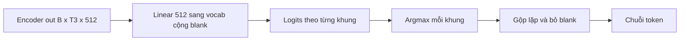

# 06 — Giải mã CTC

Kiểu giải mã đơn giản nhất: gắn một đầu tuyến tính lên đầu ra encoder và căn chuỗi bằng CTC.
Model VPB không dùng CTC làm chính (dùng RNNT), nhưng CTC là nền để hiểu hai kiểu kia.

---

## Glossary

- **CTC** — Connectionist Temporal Classification: cách huấn luyện và giải mã không cần căn nhãn theo từng khung.
- **blank** — token "không phát ra gì" tại một khung.
- **collapse** — gộp các token lặp liền nhau rồi bỏ blank để ra chuỗi cuối.
- **conditional independence** — giả định các đầu ra độc lập có điều kiện với nhau.

---

## 1. Vai trò, input, output

- **Vai trò** — ánh xạ mỗi khung encoder thành một token (hoặc blank), rồi gộp lại thành văn bản.
- **Input** — encoder out `[B, T3, 512]`.
- **Output** — logits `[B, T3, vocab+1]` (cộng 1 cho blank), rồi giải mã thành chuỗi token.
- **Neo mã nguồn** — `nemo/collections/asr/models/ctc_bpe_models.py`, đầu giải mã `ConvASRDecoder`.

---

## 2. Bộ xử lý ở giữa

- **Đầu giải mã** — một convolution 1×1 (tương đương Linear) chiếu 512 chiều xuống `vocab+1`.
- **Hàm mất mát** — CTC loss: cộng xác suất trên mọi cách căn chuỗi token với khung thời gian (thuật toán forward-backward).
- **Giải mã greedy** — lấy argmax mỗi khung, gộp token lặp liền nhau, bỏ blank.

---

## 3. Flow

---

## 4. Độ phức tạp

- **Giải mã greedy** — tuyến tính theo T3 (một argmax mỗi khung).
- **Hàm mất mát** — forward-backward theo T3 và độ dài nhãn U.
- **Bộ nhớ** — nhẹ, chỉ ma trận logits `T3 × vocab`.

---

## 5. Cách đánh giá chất lượng

- **WER / CER** — như mọi kiểu giải mã (xem `09_evaluation_wer.md`).
- **Hạn chế bản chất** — CTC giả định các đầu ra độc lập có điều kiện, không mô hình hóa phụ thuộc giữa các token; thường kém hơn RNNT khi cần mạch văn.

---

## ✅ Tự kiểm nhanh

1. Giải mã greedy của CTC gồm những bước nào?

Đáp án

Lấy argmax mỗi khung, gộp các token lặp liền nhau, rồi bỏ token blank.

2. Hạn chế bản chất của CTC là gì?

Đáp án

Giả định các đầu ra độc lập có điều kiện, không mô hình hóa phụ thuộc giữa các token, nên thường kém RNNT về mạch văn.

