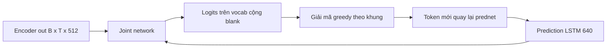

# 07 — Giải mã RNNT (kiểu model VPB dùng)

Kiểu giải mã của model VPB: encoder Conformer cộng prediction network và joint network, huấn luyện bằng transducer loss.
Đây là file trọng tâm của nhóm giải mã; các chiến lược giải mã chung (greedy, beam, streaming) trình bày tại đây.

---

## Glossary

- **RNNT** — RNN Transducer: kiến trúc giải mã có prediction network và joint network.
- **prediction network (prednet)** — mạng tự hồi quy trên chuỗi token đã sinh, đóng vai trò mô hình ngôn ngữ nội bộ.
- **joint network** — mạng gộp đầu ra encoder và prednet để ra phân phối token.
- **lattice** — lưới hai chiều thời gian × token mà transducer cộng xác suất trên đó.
- **streaming** — giải mã tăng dần khi audio chảy vào, không cần toàn câu.

---

## 1. Vai trò, input, output

- **Vai trò** — sinh token có tính đến cả ngữ cảnh âm thanh (encoder) và token đã sinh (prednet).
- **Input** — encoder out `[B, T3, 512]`; trong khi giải mã còn có token trước đó và trạng thái LSTM.
- **Output** — logits trên `vocab+1` (model VPB: 1025) cho mỗi cặp (khung, bước token).
- **Neo mã nguồn** — `nemo/collections/asr/models/rnnt_bpe_models.py`, `modules/rnnt.py`; cấu hình `model.decoder`, `model.joint`.

---

## 2. Ba thành phần (số liệu model VPB)

- **Encoder** — Conformer (xem `05_encoder_conformer.md`), ra `[B, T3, 512]`.
- **Prediction network (RNNTDecoder)**:
  - LSTM **1 lớp, hidden 640**, có embedding token, dropout 0,2, `blank_as_pad`.
  - Trạng thái `(h, c)` mỗi cái `[1, B, 640]`.
  - Vai trò: mô hình ngôn ngữ nội bộ trên token đã sinh.
- **Joint network (RNNTJoint)**:
  - Gộp encoder `[B, T, 512]` và prednet `[B, U, 640]`, qua lớp ẩn joint_hidden 640 và ReLU, rồi chiếu xuống `vocab+1`.
  - `fuse_loss_wer` gộp tính prednet, joint, loss và WER theo `fused_batch_size` để tiết kiệm bộ nhớ.

---

## 3. Flow

---

## 4. Hàm mất mát

- **Transducer loss** — cộng xác suất trên lưới hai chiều thời gian × token (mọi cách căn chuỗi); cài đặt `warprnnt_numba`.
- **Tham số** — `fastemit_lambda` (giảm độ trễ cho streaming, mặc định 0), `clamp` (cắt gradient).

---

## 5. Chiến lược giải mã (dùng chung, tham chiếu từ CTC/AED)

- **greedy_batch** — mỗi khung sinh tối đa `max_symbols` token (model VPB: 10) rồi sang khung sau; nhanh, mặc định.
- **beam** — giữ nhiều giả thuyết (model VPB cấu hình beam_size 2); chính xác hơn, chậm hơn. Có biến thể tsd, alsd.
- **streaming cache-aware** — nhờ convolution dạng causal và cache `cache_last_channel`, `cache_last_time`, model giải mã tăng dần theo luồng audio mà không cần toàn câu.

---

## 6. Độ phức tạp

- **Bộ nhớ joint** — tensor joint có dạng `[B, T, U, vocab]`, rất lớn; đây là điểm tốn nhất, được giảm bằng `fused_batch_size`.
- **Giải mã greedy** — theo T3, mỗi khung tối đa `max_symbols` bước token.
- **So với CTC** — nặng hơn do prednet và joint, đổi lại mô hình hóa phụ thuộc token và hỗ trợ streaming tốt.

---

## 7. Cách đánh giá chất lượng

- **WER** — xem `09_evaluation_wer.md`. WER thực tế model VPB trên các tập độc lập khoảng 0,26–0,28 (xem `01_asr_domain_review.md`).
- **Phù hợp streaming** — RNNT là lựa chọn chuẩn cho callbot vì giải mã tăng dần độ trễ thấp.

---

## ✅ Tự kiểm nhanh

1. Ba thành phần của RNNT là gì và prednet đóng vai trò gì?

Đáp án

Encoder, prediction network (LSTM 1 lớp hidden 640, đóng vai mô hình ngôn ngữ nội bộ trên token đã sinh) và joint network (gộp hai nguồn để ra phân phối token).

2. Vì sao tensor joint tốn bộ nhớ và cách giảm là gì?

Đáp án

Joint có dạng [B, T, U, vocab] nên rất lớn; giảm bằng cách gộp tính theo fused_batch_size (fuse_loss_wer).

3. Vì sao RNNT phù hợp callbot hơn CTC?

Đáp án

RNNT mô hình hóa phụ thuộc giữa các token và hỗ trợ giải mã streaming tăng dần độ trễ thấp, hợp với hội thoại thời gian thực.

