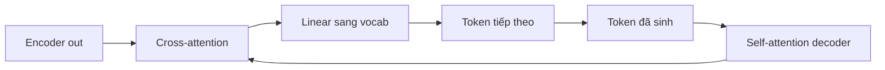

# 08 — Giải mã AED (encoder–decoder attention)

Kiểu giải mã dùng một decoder transformer tự hồi quy, gắn vào encoder qua cross-attention.
Trong NeMo là họ multitask kiểu Canary; model VPB không dùng AED, nhưng đây là cầu nối thẳng sang dịch máy và LLM.

---

## Glossary

- **AED** — Attention-based Encoder–Decoder.
- **cross-attention** — decoder "nhìn" vào đầu ra encoder để lấy thông tin âm thanh.
- **autoregressive** — sinh token tuần tự, token sau phụ thuộc token trước.
- **label smoothing** — làm mềm nhãn để tránh model quá tự tin.
- **prompt token** — token chỉ định nhiệm vụ (nhận dạng, dịch, ngôn ngữ).

---

## 1. Vai trò, input, output

- **Vai trò** — sinh văn bản tuần tự, mỗi bước nhìn lại token đã sinh và toàn bộ đầu ra encoder.
- **Input** — encoder out `[B, T3, d]` và chuỗi token đã sinh.
- **Output** — phân phối token tiếp theo trên vocab.
- **Neo mã nguồn** — `nemo/collections/asr/models/aed_multitask_models.py` (`EncDecMultiTaskModel`).

---

## 2. Bộ xử lý ở giữa

- **Decoder transformer** — nhiều lớp, mỗi lớp có self-attention (trên token đã sinh) và cross-attention (vào encoder).
- **Hàm mất mát** — cross-entropy có label smoothing trên token đúng.
- **Đa nhiệm** — prompt token đầu chuỗi quyết định nhiệm vụ (nhận dạng, dịch sang ngôn ngữ nào).

---

## 3. Flow

---

## 4. Độ phức tạp

- **Giải mã** — tuần tự U bước, mỗi bước cross-attention vào toàn bộ T3 khung.
- **Không thân thiện streaming** — cần toàn bộ đầu ra encoder trước khi sinh, khó giải mã tăng dần.
- **Bộ nhớ** — theo số lớp decoder và độ dài chuỗi.

---

## 5. Cách đánh giá chất lượng

- **WER** cho nhận dạng; **BLEU** nếu dùng cho dịch.
- **Điểm mạnh** — học tốt khi nhiều dữ liệu và đa nhiệm; đầu ra mạch lạc nhờ decoder ngôn ngữ mạnh.
- **Điểm yếu** — độ trễ cao, không hợp callbot thời gian thực.

---

## 6. Cầu nối kiến thức

- AED chính là kiến trúc **seq2seq** dùng trong dịch máy (`nlp/models/machine_translation/`) và là họ hàng gần của decoder trong LLM. Hiểu AED là bước đệm sang phần NLP/LLM của lộ trình.

---

## ✅ Tự kiểm nhanh

1. Hai loại attention trong decoder AED là gì?

Đáp án

Self-attention trên token đã sinh và cross-attention nhìn vào đầu ra encoder.

2. Vì sao AED không hợp callbot thời gian thực?

Đáp án

Giải mã tuần tự và cần toàn bộ đầu ra encoder trước khi sinh, nên độ trễ cao, khó streaming tăng dần như RNNT.

