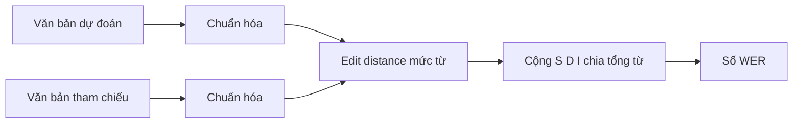

# 09 — Đánh giá chất lượng: WER

Cách đo chất lượng đầu ra ASR, các cạm bẫy khi đo, và liên hệ với kết quả thực tế của model VPB.

---

## Glossary

- **WER** — Word Error Rate: tỉ lệ lỗi tính theo từ.
- **CER** — Character Error Rate: tỉ lệ lỗi tính theo ký tự.
- **edit distance** — số phép chèn, xóa, thay tối thiểu để biến chuỗi này thành chuỗi kia (Levenshtein).
- **S / D / I** — Substitution (thay), Deletion (xóa), Insertion (chèn).
- **normalization** — chuẩn hóa văn bản trước khi so (chữ thường, bỏ dấu câu).

---

## 1. Vai trò, input, output

- **Vai trò** — đo độ lệch giữa văn bản dự đoán và văn bản tham chiếu.
- **Input** — chuỗi từ dự đoán và chuỗi từ tham chiếu.
- **Output** — một số WER (càng thấp càng tốt).
- **Neo mã nguồn** — `nemo/collections/asr/metrics/wer.py`.

---

## 2. Công thức

- **WER** = (S + D + I) / N, với N là số từ trong tham chiếu.
- **Cách tính** — tính edit distance ở mức từ giữa hai chuỗi, cộng dồn S, D, I trên toàn tập rồi chia tổng số từ tham chiếu.
- **CER** — tương tự nhưng ở mức ký tự; hữu ích khi tách từ không rõ ràng.

---

## 3. Flow

---

## 4. Độ phức tạp

- **Edit distance** — theo tích độ dài hai chuỗi (số từ dự đoán nhân số từ tham chiếu) cho mỗi câu.
- **Trên toàn tập** — cộng dồn tuyến tính theo số câu.

---

## 5. Cạm bẫy khi đo (quan trọng)

- **Chuẩn hóa văn bản** — WER phụ thuộc cách chuẩn hóa (chữ thường, dấu câu, số viết chữ hay viết số). Phải dùng cùng chuẩn cho dự đoán và tham chiếu.
- **Rò rỉ dữ liệu (data leakage)** — nếu tập test trùng tập train, WER thấp là giả. Ví dụ thực tế: `standard_test_2` trùng ~70% với train, nên WER trên đó lạc quan (xem `01_asr_domain_review.md`).
- **Kích thước tập** — tập quá nhỏ (ví dụ 29 mẫu) cho số dao động mạnh, không kết luận được.
- **Tập đáng tin của model VPB** — `next_day_test_debug` và `vpb_right2_valid` (không trùng train).

---

## 6. Cách đánh giá đúng

- **Chọn tập độc lập** — không trùng train, đủ lớn.
- **Báo cáo nhiều tập** — kèm ghi chú về rò rỉ và kích thước.
- **So sánh cùng chuẩn hóa** — giữa các model và baseline (ví dụ so Fast-Conformer với Chunkformer).

---

## ✅ Tự kiểm nhanh

1. WER được tính bằng công thức nào?

Đáp án

WER = (S + D + I) / N, với S/D/I là số phép thay/xóa/chèn (edit distance mức từ) và N là số từ tham chiếu.

2. Hai cạm bẫy lớn nhất khi đọc một con số WER là gì?

Đáp án

Rò rỉ dữ liệu (test trùng train làm WER giả thấp) và khác chuẩn hóa văn bản giữa dự đoán và tham chiếu. Ngoài ra tập quá nhỏ cho số dao động.

