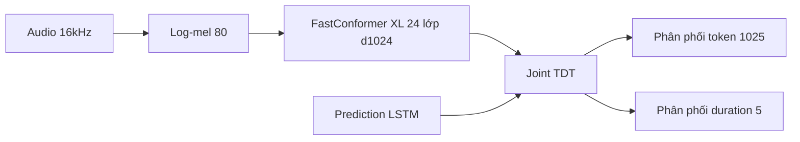

# Parakeet-TDT-0.6b-v2 — cấu trúc

Số liệu đo thật bằng `notebooks/01_explore_model_config.ipynb` (CPU) + model card HuggingFace `nvidia/parakeet-tdt-0.6b-v2`.

---

## Glossary

- **TDT** — Token-and-Duration Transducer: transducer dự đoán đồng thời token và thời lượng (duration).
- **duration** — số khung encoder model nhảy qua trước khi dự đoán token kế.
- **joint network** — mạng gộp đầu ra encoder và prediction network để ra phân phối.
- **d_model** — số chiều biểu diễn ẩn của encoder.
- **XL** — biến thể FastConformer cỡ lớn (d_model 1024, 24 lớp).

---

## 1. Tổng quan thành phần

- **Class NeMo** — `EncDecRNNTBPEModel` (chung lớp với RNNT; TDT là cấu hình loss/joint).
- **Tổng tham số** — **617.825.926 (~618M)**: encoder 608,88M (98,6%) · decoder 7,22M · joint 1,73M.
- **Tokenizer** — SentencePiece BPE, **1024 token**.

---

## 2. Encoder — FastConformer XL (đo thật)

| Thuộc tính         | Giá trị                        |
| -------------------- | -------------------------------- |
| class                | ConformerEncoder                 |
| d_model              | **1024**                   |
| n_layers             | **24**                     |
| n_heads              | 8                                |
| ff_expansion_factor  | 4 (d_ff = 4096)                  |
| subsampling          | dw_striding,**×8**        |
| self_attention_model | rel_pos (vị trí tương đối) |
| conv_kernel_size     | 9                                |

- Cấu trúc một `ConformerLayer` (macaron: FFN½ → self-attn → conv → FFN½ → LayerNorm) giống hệt phần đã phân tích ở `../../02_asr_components/05_encoder_conformer.md`, chỉ khác kích thước (d_model 1024 thay vì 512, 24 lớp thay vì 17).

---

## 3. Decoder + Joint — cơ chế TDT (đo thật)

- **Prediction network (RNNTDecoder)** — LSTM, hidden 640; vai trò mô hình ngôn ngữ nội bộ (giống RNNT).
- **Joint (RNNTJoint)** — `enc: Linear(1024→640)`, `pred: Linear(640→640)`, `joint_net` ra **1030**.

**Bằng chứng TDT (số thật):**

- `joint_out = 1030 = 1024 token + 1 blank + 5 duration`.
- Cấu hình loss: `tdt_kwargs.durations = [0, 1, 2, 3, 4]` → 5 giá trị duration.
- Nghĩa là mỗi bước giải mã, ngoài việc chọn token, model còn chọn **nhảy 0–4 khung** encoder.

### So sánh joint với RNNT thuần

|                    | RNNT (Fast-Conformer VPB)   | TDT (Parakeet)                        |
| ------------------ | --------------------------- | ------------------------------------- |
| joint_out          | 1025 = vocab 1024 + 1 blank | 1030 = 1024 + 1 +**5 duration** |
| Cách duyệt khung | từng khung một            | nhảy theo duration dự đoán        |
| Hệ quả           | chậm hơn                  | nhanh hơn, WER tương đương      |

---

## 4. Input / Output / độ phức tạp

- **Input** — waveform 16kHz → log-mel `[B, 80, T]` → encoder `[B, 1024, T/8]`.
- **Output** — chuỗi token (giải mã ngược ra văn bản, có dấu câu + viết hoa).
- **Độ phức tạp** — encoder như Conformer (self-attention bậc hai theo độ dài, đã giảm nhờ subsampling ×8); decode TDT **giảm số bước joint** so với RNNT nhờ bỏ khung.

---

## ✅ Tự kiểm nhanh

1. Vì sao joint_out của Parakeet là 1030 chứ không phải 1025?

Đáp án

1030 = 1024 token + 1 blank + 5 duration (`durations=[0,1,2,3,4]`). 5 chiều duration là phần TDT thêm so với RNNT thuần (1025).

2. Encoder Parakeet-0.6b khác encoder Fast-Conformer VPB ở số liệu nào?

Đáp án

Cùng kiến trúc ConformerEncoder nhưng lớn hơn: d_model 1024 (so với 512), 24 lớp (so với 17), subsampling vẫn ×8.

