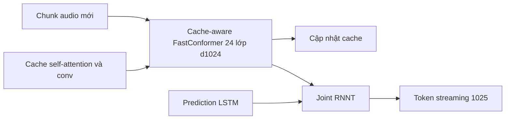

# Nemotron-Speech-Streaming-0.6b — cấu trúc

Số liệu đo thật bằng `notebooks/01_explore_model_config.ipynb` (CPU) + model card HuggingFace `nvidia/nemotron-speech-streaming-en-0.6b`.

---

## Glossary

- **Streaming** — giải mã tăng dần khi audio chảy vào, không cần toàn câu.
- **Cache-aware** — nhớ trạng thái encoder để chỉ xử lý phần audio mới, không tính lại phần cũ.
- **att_context_size** — `[left, right]`: số khung ngữ cảnh trái/phải self-attention được nhìn (khung 80ms).
- **buffered streaming** — kiểu streaming cũ chia cửa sổ chồng lấn (tính lặp).
- **RNNT** — RNN Transducer (decoder của model này).

---

## 1. Tổng quan thành phần

- **Class NeMo** — `EncDecRNNTBPEModel`.
- **Tổng tham số** — **~618,1M**: encoder ~609M · decoder 7,22M · joint 1,72M (đo bằng notebook).
- **Tokenizer** — SentencePiece BPE, **1024 token**; **joint_out = 1025 = 1024 + 1 blank** (RNNT thuần, KHÔNG có duration như TDT).
- **Ngôn ngữ** — tiếng Anh (bản en); bản **Nemotron-3.5-ASR-Streaming** mở rộng 40 ngôn ngữ-locale.

---

## 2. Encoder — Cache-aware FastConformer (đo thật)

| Thuộc tính | Giá trị |
| --- | --- |
| class | ConformerEncoder |
| d_model | **1024** |
| n_layers | **24** |
| n_heads | 8 |
| ff_expansion_factor | 4 (d_ff = 4096) |
| subsampling | dw_striding, **×8** |
| self_attention_model | rel_pos |
| conv_kernel_size | 9 |

- Cùng cấu trúc ConformerLayer như `../../02_asr_components/05_encoder_conformer.md`; điểm khác là **chế độ cache-aware** + convolution dạng causal để chạy streaming.

---

## 3. Cơ chế cache-aware streaming (cốt lõi)

- **Vấn đề của buffered streaming** — chia audio thành cửa sổ chồng lấn; mỗi khung bị tính lại nhiều lần → lãng phí.
- **Cache-aware**:
  - Nhớ (cache) trạng thái **self-attention và convolution** của mọi lớp encoder.
  - Khi audio mới tới, chỉ xử lý **chunk mới (delta)**, tái dùng cache cho ngữ cảnh quá khứ.
  - **Mỗi khung tính đúng một lần, không chồng lấn** → nhanh hơn ~3 lần buffered.
- **Decoder** — RNNT (giống Fast-Conformer VPB), joint_out 1025; phần streaming nằm ở encoder + cache.

---

## 4. Điều chỉnh độ trễ qua `att_context_size`

Cấu hình `[left, right]` (đơn vị khung 80ms); `right` quyết định độ trễ. Chọn lúc suy luận, **không cần huấn luyện lại**.

| att_context_size | Số khung chunk | Độ trễ |
| --- | --- | --- |
| [70, 0] | 1 | 0,08s |
| [70, 1] | 2 | 0,16s |
| [70, 6] | 7 | 0,56s |
| [70, 13] | 14 | 1,12s |

- `right` nhỏ → độ trễ thấp, chính xác thấp hơn; `right` lớn → ngược lại. Đây là đường latency-accuracy Pareto.
- `att_context_size` nằm trong **config encoder** (không phải decoding).

---

## ✅ Tự kiểm nhanh

1. joint_out của Nemotron là 1025 — khác Parakeet (1030) ở đâu và vì sao?

Đáp án

Nemotron dùng RNNT thuần nên joint_out = 1024 token + 1 blank = 1025, không có phần duration. Parakeet dùng TDT nên có thêm 5 duration → 1030.

2. Cache-aware tiết kiệm gì so với buffered streaming?

Đáp án

Buffered tính lại các khung chồng lấn nhiều lần; cache-aware nhớ trạng thái self-attention/conv và chỉ xử lý chunk mới, mỗi khung tính đúng một lần (~3 lần nhanh hơn).

3. Điều chỉnh độ trễ làm ở đâu trong cấu hình?

Đáp án

Ở `att_context_size = [left, right]` trong config encoder; right lớn thì độ trễ cao + chính xác hơn. Đổi lúc suy luận, không cần train lại.

