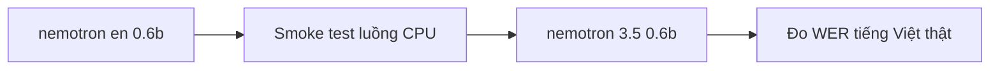

# Nemotron Speech — các bộ pretrained weight

Khảo sát các checkpoint Nemotron Speech (streaming ASR) có thật trên HuggingFace để chọn bản chạy smoke-test phiên âm trên CPU. Điểm đáng chú ý: bản đa ngôn ngữ có tiếng Việt sẵn. Số liệu lấy từ model card HuggingFace `nvidia/nemotron-*` (tra 2026-06-19).

---

## Glossary

- **checkpoint** — bộ trọng số đã huấn luyện sẵn (file `.nemo` / `safetensors`) để nạp mà không cần train lại.
- **NGC** — NVIDIA GPU Cloud, kho model/container của NVIDIA; model Nemotron đồng thời có trên HuggingFace.
- **from_pretrained** — hàm NeMo `ASRModel.from_pretrained("id")` tự tải checkpoint về cache rồi dựng model.
- **streaming / cache-aware** — giải mã tăng dần theo từng chunk audio, nhớ trạng thái encoder để không tính lại phần cũ (xem `01_structure.md`).
- **chunk size** — độ dài cửa sổ audio mỗi bước (80ms / 160ms / 560ms / 1120ms), đổi lúc suy luận để cân latency–accuracy.
- **language-ID prompt** — bản đa ngôn ngữ nhận thêm tín hiệu chọn ngôn ngữ (prompt) để biết phiên âm theo tiếng nào.
- **tier** — mức độ chín của từng ngôn ngữ: transcription-ready (dùng ngay, chính xác cao) · broad-coverage (dùng được, rộng) · adaptation-ready (tokenizer nhận, cần fine-tune mới đạt).
- **OpenMDW-1.1 / NVIDIA Open Model License** — giấy phép phát hành; cần đọc kỹ điều khoản trước khi dùng thương mại (cần kiểm chứng phạm vi cho từng bản).

---

## Bảng các bộ weight

| id HF | params | decoder | ngôn ngữ | license | dung lượng | tải được CPU? |
| --- | --- | --- | --- | --- | --- | --- |
| `nvidia/nemotron-speech-streaming-en-0.6b` | ~0.6B | RNNT (cache-aware streaming) | English (en-US) | NVIDIA Open Model License | ~2.4–2.5 GB (cần kiểm chứng) | Có |
| `nvidia/nemotron-3.5-asr-streaming-0.6b` | ~0.6B | RNNT (cache-aware streaming) | 40 language-locales (có tiếng Việt) | OpenMDW-1.1 | ~2.4–2.5 GB (cần kiểm chứng) | Có |

Ghi chú:
- Hai bản cùng cỡ ~0.6B, cùng kiến trúc cache-aware FastConformer + RNNT (joint_out 1025, xem `01_structure.md`). Bản `3.5` là **mở rộng đa ngôn ngữ** của bản `en` bằng cách thêm language-ID prompt conditioning.
- Cột dung lượng là ước lượng theo số tham số (fp32 ≈ 4 byte/tham số → 0.6B ≈ 2.4 GB). Model card không in con số GB chính xác → xem mục "Files and versions" trên HuggingFace để chốt.
- Hỗ trợ chunk size cấu hình lúc chạy (en: 80/160/560/1120ms; 3.5: thêm 320ms) — đổi độ trễ không cần train lại.

---

## Hỗ trợ tiếng Việt

Nói thẳng từng bản:

- `nvidia/nemotron-speech-streaming-en-0.6b` — **KHÔNG có tiếng Việt** (English-only, dữ liệu train là en-US).
- `nvidia/nemotron-3.5-asr-streaming-0.6b` — **CÓ tiếng Việt (vi-VN)**, và nằm ở **tier cao nhất "transcription-ready"** (19 locale dùng ngay, chính xác cao), không phải tier cần fine-tune.

Phân tầng 40 language-locales của bản 3.5:

- **Transcription-ready (19, dùng ngay):** en-US, en-GB, es-US, es-ES, fr-FR, fr-CA, it-IT, pt-BR, pt-PT, nl-NL, de-DE, tr-TR, ru-RU, ar-AR, hi-IN, ja-JP, ko-KR, **vi-VN**, uk-UA.
- **Broad-coverage (13):** pl-PL, sv-SE, cs-CZ, nb-NO, da-DK, bg-BG, fi-FI, hr-HR, sk-SK, zh-CN, hu-HU, ro-RO, et-EE.
- **Adaptation-ready (8, cần fine-tune):** el-GR, lt-LT, lv-LV, mt-MT, sl-SI, he-IL, th-TH, nn-NO.

Hệ quả cho bài toán callbot tiếng Việt (giống VPB cũ): **`nemotron-3.5-asr-streaming-0.6b` là checkpoint tải về dùng tiếng Việt được ngay**, lại còn là streaming (hợp callbot thời gian thực). Đây là khác biệt then chốt so với toàn bộ họ Parakeet (không có bản tiếng Việt nào).

Lưu ý kiểm chứng trước khi dùng thật:
- Tiếng Việt ở tier transcription-ready theo model card, nhưng **chất lượng thực tế trên giọng/điện thoại tiếng Việt phải tự đo WER** bằng audio của mình, đừng tin con số leaderboard.
- License OpenMDW-1.1 (bản 3.5) và NVIDIA Open Model License (bản en) **phải đọc kỹ điều khoản thương mại** — chưa khẳng định ở đây, cần kiểm chứng.

---

## Lệnh tải + smoke test

Repo đã có sẵn `src/asr_lab/eval/smoke.py`. Cú pháp:

```bash
uv run python -m asr_lab.eval.smoke <duong_dan.wav> [--model <id_HF>]
```

Yêu cầu file wav: **mono, 16kHz** (resample trước nếu khác sample_rate).

Tải + chạy bản tiếng Anh (smoke-test luồng):

```bash
uv run python -m asr_lab.eval.smoke mau.wav --model nvidia/nemotron-speech-streaming-en-0.6b
```

Tải + chạy bản đa ngôn ngữ có tiếng Việt:

```bash
# Bản 3.5 có vi-VN ở tier transcription-ready
uv run python -m asr_lab.eval.smoke mau_tieng_viet.wav --model nvidia/nemotron-3.5-asr-streaming-0.6b
```

Lưu ý: bản đa ngôn ngữ dùng **language-ID prompt** để chọn tiếng. `smoke_transcribe.py` hiện gọi `transcribe([...])` mặc định — với bản 3.5 có thể cần truyền thêm tham số chọn ngôn ngữ/prompt theo API của model. **Cần kiểm chứng cú pháp transcribe cho prompt tiếng Việt** khi chạy thật (xem model card / NeMo docs); nếu thiếu prompt, model có thể auto hoặc mặc định en.

`from_pretrained` tự tải checkpoint về cache HuggingFace (`~/.cache/huggingface`) lần đầu. Tải thủ công nếu muốn:

```bash
huggingface-cli download nvidia/nemotron-3.5-asr-streaming-0.6b
```

---

## Khuyến nghị cho lab CPU

Mục tiêu là smoke-test luồng tải + phiên âm chạy thông trên CPU.

1. **Smoke-test luồng (tiếng Anh): `nvidia/nemotron-speech-streaming-en-0.6b`** — ~0.6B, xác nhận luồng cache-aware streaming chạy trên CPU.
2. **Bản dùng cho mục tiêu tiếng Việt: `nvidia/nemotron-3.5-asr-streaming-0.6b`** — cùng cỡ ~0.6B, tải được trên CPU, có vi-VN sẵn. Đây là bản đáng đầu tư thời gian nhất vì khớp bài toán callbot tiếng Việt.
3. Cả hai đều ~0.6B nên đều chạy được CPU; không có bản 1.1B trong họ này nên không có cái nào "quá nặng phải bỏ".

Trình tự đề xuất: chạy bản `en` trước để chắc luồng thông → chuyển sang bản `3.5` với audio tiếng Việt thật để đo WER.



---

## ✅ Tự kiểm nhanh

1. Bản Nemotron nào hỗ trợ tiếng Việt, và ở tier nào?

<details><summary>Đáp án</summary>

`nvidia/nemotron-3.5-asr-streaming-0.6b` có tiếng Việt (vi-VN), nằm ở tier cao nhất "transcription-ready" (19 locale dùng ngay). Bản `en-0.6b` chỉ có tiếng Anh.
</details>

2. Hai bản Nemotron khác nhau cốt lõi ở đâu?

<details><summary>Đáp án</summary>

Cùng cỡ ~0.6B, cùng kiến trúc cache-aware FastConformer + RNNT. Bản `3.5` mở rộng đa ngôn ngữ (40 locale) bằng language-ID prompt conditioning; bản `en` chỉ tiếng Anh.
</details>

3. Vì sao Nemotron hợp callbot tiếng Việt hơn Parakeet?

<details><summary>Đáp án</summary>

Nemotron-3.5 có tiếng Việt sẵn ở tier transcription-ready và là model streaming (cache-aware, hợp thời gian thực). Cả họ Parakeet không có checkpoint tiếng Việt nào. Vẫn phải tự đo WER trên audio tiếng Việt thật trước khi tin dùng.
</details>
