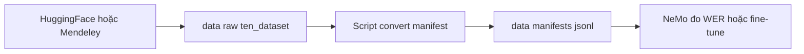

# 04 — Dataset tiếng Việt cho ASR (khảo sát + cách dùng)

Điểm vào (entry point) cho cụm tài liệu **dataset tiếng Việt dùng chung** giữa các model ASR trong lab.
Mục tiêu: có bộ dữ liệu **có transcript** để (a) smoke-test nhanh trên CPU, (b) đo WER nghiêm túc,
(c) tiến dần tới domain **điện thoại/callbot**.

> Đây là tài liệu **khảo sát** (survey). Không có file audio thật trong repo. Mỗi file con ghi rõ
> **lệnh tải** để Mr. Kỳ tự chạy khi cần.

---

## Glossary (thuật ngữ)

- **Read speech (đọc văn bản):** người nói đọc câu cho sẵn trong phòng yên tĩnh. Âm sạch, dễ cho model
  → tốt để smoke-test nhưng **xa domain callbot**.
- **Conversational/spontaneous (hội thoại/tự nhiên):** lời nói tự nhiên (podcast, phỏng vấn, gọi điện).
  Gần domain callbot hơn, khó hơn.
- **Telephony (điện thoại):** audio đi qua mạng điện thoại, thường **8kHz**, băng thông hẹp, có nhiễu.
  Đây là **domain lý tưởng nhất** cho callbot của Mr. Kỳ.
- **Sample rate (tần số lấy mẫu):** 16kHz = chuẩn dataset đọc; 8kHz = chuẩn điện thoại.
- **WER (Word Error Rate):** tỉ lệ lỗi từ — thước đo chính của ASR. Cần transcript chuẩn để tính.
- **Manifest NeMo:** file `.jsonl`, mỗi dòng 1 mẫu: `{"audio_filepath": ..., "duration": ..., "text": ...}`.
- **Validated hours (giờ đã kiểm duyệt):** với Common Voice, số giờ đã được cộng đồng vote là đúng.

---

## Bảng so sánh tổng hợp

| Dataset | Giờ (approx) | Loại | Sample rate | Transcript | License | Tải dễ? |
| --- | --- | --- | --- | --- | --- | --- |
| [VIVOS](02_vivos.md) | ~15.7h | Đọc | 16kHz | Có | CC BY-NC-SA 4.0 (chỉ nghiên cứu) | Rất dễ (HF) |
| [Common Voice VI](01_common_voice_vi.md) | ~21h thu / ~6.7h validated | Đọc | 16kHz (mp3) | Có | CC0 (thương mại OK) | Trung bình (cần tài khoản Mozilla) |
| [FOSD (FPT)](03_fosd_fpt.md) | ~30h | Đọc | mp3 | Có | CC BY 4.0 (thương mại OK) | Dễ (HF mirror + Mendeley) |
| [VLSP2020 VinAI 100h](04_vlsp2020.md) | ~100h | Đọc (tin tức) | cần kiểm chứng | Có | CC BY 4.0 (thương mại OK) | Dễ (HF) |
| [VietBud500](05_vietbud500.md) | ~500h | Đọc + podcast/sách | 16kHz | Có | CC BY-NC-SA 4.0 (chỉ nghiên cứu) | Dễ (HF, ~98GB) |
| [LSVSC](06_lsvsc.md) | ~100h | Đọc + sách/tin | cần kiểm chứng | Có | CC BY 4.0 (thương mại OK) | Dễ (HF) |
| [VietSuperSpeech](07_vietsuperspeech.md) | ~103h | Hội thoại (podcast/phỏng vấn) | 16kHz | Có (auto-label) | MIT (thương mại OK) | Dễ (HF) |
| [infore (25h + audiobooks)](08_infore.md) | ~25h + audiobook | Đọc + audiobook | cần kiểm chứng | Có | cần kiểm chứng | Dễ (HF mirror) |
| [PhoAudiobook](09_phoaudiobook.md) | ~940h (gốc TTS) | Audiobook/đọc | cần kiểm chứng | Có | License nghiên cứu (cấm phân phối lại) | Cần đồng ý điều khoản |

> **Lưu ý số liệu:** giờ audio lấy theo thẻ dataset (HuggingFace/Mendeley) tại thời điểm khảo sát 2026-06.
> Chỗ ghi "cần kiểm chứng" nghĩa là thẻ không nêu rõ — phải mở file thật ra đo lại trước khi tin.
> Riêng FOSD: HF mirror `doof-ferb/fpt_fosd` ghi nhầm "100 hours"; nguồn gốc Mendeley + GitHub FPT
> xác nhận chỉ **~30h / 25.921 mẫu** — tin theo Mendeley.

---

## Khuyến nghị: bắt đầu từ đâu

Theo thứ tự ưu tiên cho lab CPU của Mr. Kỳ:

1. **Bắt đầu smoke-test ngay — VIVOS (~15.7h).**
   Nhỏ nhất, có sẵn split `test` chỉ ~45 phút / 760 câu, tải 1 lệnh từ HuggingFace, có transcript chuẩn.
   Dùng để chạy thử pipeline đo WER trên CPU mà không tốn thời gian.
   *Hạn chế license:* CC BY-NC-SA → **chỉ nghiên cứu**, không dùng để bán sản phẩm. Smoke-test thì OK.

2. **Đo WER nghiêm túc + có thể thương mại — FOSD (~30h, CC BY 4.0).**
   License rộng (cho phép thương mại), giọng đọc rõ, cỡ vừa. Hợp để báo cáo WER có ý nghĩa hơn VIVOS.
   Kết hợp thêm **Common Voice VI** (CC0) nếu cần bộ test sạch license tuyệt đối.

3. **Gần domain callbot nhất — VietSuperSpeech (~103h hội thoại, MIT).**
   Đây là bộ **hội thoại tự nhiên** (podcast/phỏng vấn), gần callbot hơn hẳn các bộ đọc.
   *Cảnh báo:* transcript là **auto-label** (sinh bằng model Zipformer), không phải người gõ tay
   → WER đo trên bộ này có sai số nền, dùng để cảm nhận domain chứ đừng coi là "chân lý".

4. **Khi fine-tune thật — VietBud500 (~500h) hoặc LSVSC/VLSP100h.**
   Dữ liệu lớn để train. VietBud500 lớn nhất nhưng CC BY-NC-SA (chỉ nghiên cứu) và nặng ~98GB.

**Khoảng trống cần biết:** chưa tìm được bộ **điện thoại 8kHz tiếng Việt công khai có transcript**.
Tất cả bộ trên đều 16kHz (đọc hoặc hội thoại). Để mô phỏng điện thoại có thể **downsample 16kHz → 8kHz**
rồi resample lại (giả lập băng thông hẹp) khi test — sẽ ghi cách làm ở file VietSuperSpeech.

---

## Nơi lưu dữ liệu thật (đề xuất)

Dữ liệu audio **rất nặng** (VietBud500 ~98GB) nên **không bao giờ commit vào git**.

- Đề xuất 1 folder dùng chung ở **gốc repo**: `nvidia_asr_nemo/data/`
  - `data/raw/<ten_dataset>/` — dữ liệu tải về nguyên gốc (wav/mp3 + transcript).
  - `data/manifests/<ten_dataset>/` — file `.jsonl` manifest NeMo đã convert.
  - `data/cache_hf/` — cache của HuggingFace `datasets` (đặt `HF_HOME` trỏ vào đây nếu muốn gọn).
- **BẮT BUỘC gitignore** toàn bộ `data/`. Thêm vào `.gitignore`:
  ```
  # Dữ liệu ASR nặng — không commit
  /data/
  ```
- Lý do tách khỏi folder model: dataset **dùng chung** cho nhiều model (Parakeet, Nemotron, ...),
  không thuộc riêng model nào.



---

## ✅ Tự kiểm nhanh

1. Bộ nào nên dùng đầu tiên để smoke-test WER trên CPU, vì sao?
2. Vì sao chưa thể đo WER "chuẩn domain callbot" bằng các bộ này?

<details>
<summary>Đáp án</summary>

1. **VIVOS** — nhỏ nhất (~15.7h, riêng test chỉ ~45 phút), 1 lệnh tải từ HuggingFace, transcript chuẩn người gõ.
2. Vì **không có bộ điện thoại 8kHz công khai có transcript**. Bộ gần nhất là VietSuperSpeech (hội thoại 16kHz)
   nhưng transcript là auto-label nên có sai số nền; muốn giống điện thoại phải tự downsample 16kHz→8kHz.

</details>
