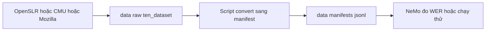

# 05 — Dataset tiếng Anh cho ASR (khảo sát + cách dùng)

Điểm vào (entry point) cho cụm tài liệu **dataset tiếng Anh dùng chung** giữa các model tiếng Anh trong lab:
`parakeet-tdt-0.6b-v2`, `parakeet-tdt_ctc-110m`, `nemotron-speech-streaming-en-0.6b`.

Mục tiêu hẹp và rõ: **smoke-test thông luồng inference trên CPU** — tải model, phiên âm, tính WER cơ bản.
Đây KHÔNG phải benchmark nặng → ưu tiên bộ **càng nhỏ càng tốt** (vài file đến vài giờ audio), tải nhanh.

> Đây là tài liệu **khảo sát** (survey). Không có file audio thật trong repo. Mỗi file con ghi rõ
> **lệnh tải** để Mr. Kỳ tự chạy khi cần. Số liệu lấy theo nguồn gốc tại thời điểm khảo sát 2026-06;
> chỗ ghi "cần kiểm chứng" nghĩa là nguồn không nêu rõ — phải mở file thật ra đo lại trước khi tin.

---

## Glossary (thuật ngữ)

- **Smoke-test (kiểm tra khói):** chạy thử cực nhanh chỉ để xác nhận luồng KHÔNG vỡ (tải model + phiên âm
  + tính WER chạy thông), chưa quan tâm chất lượng. Càng ít dữ liệu càng nhanh.
- **Read speech (đọc văn bản):** người nói đọc câu cho sẵn trong phòng yên tĩnh. Âm sạch, dễ cho model.
  Cả AN4, LibriSpeech đều thuộc loại này.
- **WER (Word Error Rate):** tỉ lệ lỗi từ — thước đo chính của ASR. Cần transcript chuẩn để tính.
- **Sample rate (tần số lấy mẫu):** 16kHz = chuẩn dataset đọc hiện đại. Các model ở đây cần wav **mono 16kHz**.
- **Manifest NeMo:** file `.jsonl`, mỗi dòng 1 mẫu: `{"audio_filepath": ..., "duration": ..., "text": ...}`.
  Đây là định dạng NeMo dùng để chạy đánh giá hàng loạt.
- **.sph (NIST SPHere):** định dạng audio cũ của AN4 — phải convert sang `.wav` bằng `sox` trước khi dùng.
- **.flac:** LibriSpeech lưu dưới dạng FLAC (nén không mất dữ liệu). NeMo đọc được trực tiếp, nhưng nhiều
  pipeline vẫn convert sang `.wav` cho gọn.
- **utterance (câu nói):** 1 đoạn ghi âm 1 câu/cụm. AN4 đo bằng số utterance (948 train + 130 test),
  không tính ra "giờ" rõ ràng vì mỗi câu rất ngắn (đánh vần chữ/số).

---

## Bảng so sánh tổng hợp

| Dataset | Giờ / Số file | Sample rate | Transcript | License | Tải dễ? |
| --- | --- | --- | --- | --- | --- |
| [Sample wav lẻ của NeMo](01_nemo_sample_wav.md) | 1-3 file (vài giây/file) | 16kHz wav | Có (in trong tutorial) | Mẫu công khai (cần kiểm chứng) | Cực dễ (1 lệnh `wget`) |
| [AN4](02_an4.md) | ~948 train + 130 test utterance (~64MB, vài phút audio) | 16kHz wav (sau convert từ .sph) | Có | Công khai từ CMU (cần kiểm chứng điều khoản) | Dễ (1 file tar + `sox`) |
| [Mini LibriSpeech](03_mini_librispeech.md) | dev-clean-2 ~126MB / train-clean-5 ~332MB | 16kHz flac | Có | CC BY 4.0 (thương mại OK) | Dễ (OpenSLR, 1 file tar) |
| [LibriSpeech dev/test-clean](04_librispeech.md) | dev-clean ~5.4h (337MB) / test-clean ~5.4h (346MB) | 16kHz flac | Có | CC BY 4.0 (thương mại OK) | Dễ (OpenSLR, 1 file tar/subset) |
| [Common Voice English](05_common_voice_en.md) | Toàn bộ rất lớn; có **delta** + subset spontaneous ~7h validated | 16kHz mp3 (cần convert) | Có | CC0 (thương mại OK) | Trung bình (cần tài khoản/đồng ý điều khoản) |

> **Lưu ý license:**
> - **AN4**: bộ học thuật cũ của CMU, dùng rộng rãi trong tutorial NeMo/Sphinx. Điều khoản phân phối lại
>   cụ thể **cần kiểm chứng** nếu định dùng thương mại; cho smoke-test nội bộ thì an toàn.
> - **LibriSpeech / Mini LibriSpeech**: **CC BY 4.0** — cho phép thương mại, chỉ cần ghi công.
> - **Common Voice**: **CC0** — license rộng nhất (kể cả thương mại), nhưng tải bản đầy đủ phải qua
>   trang Mozilla (đồng ý điều khoản / có thể cần tài khoản).

---

## Khuyến nghị: bắt đầu từ đâu

Theo thứ tự ưu tiên cho mục tiêu **smoke-test trên CPU** của Mr. Kỳ:

1. **Bước 0 — chỉ cần CHẮC luồng chạy: dùng [sample wav lẻ của NeMo](01_nemo_sample_wav.md).**
   Tải 1 file `.wav` vài giây bằng 1 lệnh `wget`, chạy thẳng `src/asr_lab/eval/smoke.py`. Không cần manifest,
   không cần WER. Đây là cách **nhanh nhất** để biết model tải về và phiên âm được trên máy.
   File chuẩn hay dùng: `2086-149220-0033.wav` (lấy từ LibriSpeech, có transcript đi kèm trong tutorial NeMo).

2. **Bước 1 — smoke-test luồng WER hàng loạt nhỏ nhất: [AN4](02_an4.md) (~64MB).**
   Bộ tí hon kinh điển trong tutorial NeMo (đánh vần chữ/số). Có sẵn split train/test, NeMo có script
   `process_an4_data.py` build thẳng `train_manifest.json` + `test_manifest.json`. Tải nhanh, đủ để chạy
   thông luồng đo WER mà không tốn thời gian. **Lựa chọn nhỏ nhất có manifest sẵn.**

3. **Bước 2 — WER có ý nghĩa hơn, license sạch: [Mini LibriSpeech](03_mini_librispeech.md) hoặc
   [LibriSpeech test-clean](04_librispeech.md).**
   Mini LibriSpeech `dev-clean-2` chỉ ~126MB nhưng là giọng đọc tự nhiên (không phải đánh vần như AN4)
   → WER phản ánh năng lực model sát hơn. Nếu cần con số chuẩn để so với bảng công bố của model thì dùng
   **LibriSpeech test-clean** (~5.4h) — đây là bộ test mọi paper ASR tiếng Anh đều báo cáo. Cả hai **CC BY 4.0**.

4. **Khi cần license tuyệt đối thoáng (kể cả thương mại): [Common Voice English](05_common_voice_en.md) (CC0).**
   Giọng cộng đồng đa dạng (gần đời thực hơn LibriSpeech). Tải rườm rà hơn (qua trang Mozilla) và là mp3
   nên phải convert sang wav 16kHz. Không phải lựa chọn smoke-test đầu tiên, nhưng tốt khi cần dữ liệu sạch
   license để dùng lâu dài.

**Kết luận 1 dòng:** nhanh nhất là **sample wav lẻ của NeMo** (1 file, 1 lệnh); nhỏ nhất có manifest WER sẵn
là **AN4**; chuẩn để so số là **LibriSpeech test-clean**.

---

## Nơi lưu dữ liệu thật (đề xuất — dùng chung với khảo sát tiếng Việt)

Dùng **cùng một folder data** như cụm tiếng Việt (`docs/04_datasets_vi`) đã đề xuất, để không phân mảnh:

- Folder dùng chung ở **gốc repo**: `nvidia_asr_nemo/data/`
  - `data/raw/<ten_dataset>/` — dữ liệu tải về nguyên gốc (wav/flac/mp3 + transcript). Ví dụ:
    `data/raw/an4/`, `data/raw/librispeech/`, `data/raw/nemo_samples/`.
  - `data/manifests/<ten_dataset>/` — file `.jsonl` manifest NeMo đã convert.
  - `data/cache_hf/` — cache HuggingFace `datasets` (đặt `HF_HOME` trỏ vào đây nếu tải qua HF).
- **BẮT BUỘC gitignore** toàn bộ `data/` (audio nặng, không bao giờ commit). Thêm vào `.gitignore`:
  ```
  # Dữ liệu ASR nặng — không commit
  /data/
  ```
- Lý do tách khỏi folder model: dataset **dùng chung** cho nhiều model (Parakeet, Nemotron, ...),
  không thuộc riêng model nào.



---

## ✅ Tự kiểm nhanh

1. Để CHẮC luồng tải model + phiên âm chạy được trên CPU mà tốn ít công nhất, nên dùng dữ liệu nào?
2. Bộ nhỏ nhất nào có sẵn script build manifest train/test để smoke-test luồng đo WER?
3. Muốn so WER với bảng số công bố của model tiếng Anh thì nên đo trên bộ nào?

<details>
<summary>Đáp án</summary>

1. **Sample wav lẻ của NeMo** — tải 1 file `.wav` vài giây bằng 1 lệnh `wget`, chạy thẳng
   `src/asr_lab/eval/smoke.py`, không cần manifest hay WER.
2. **AN4** (~64MB) — NeMo có `process_an4_data.py` build sẵn `train_manifest.json` + `test_manifest.json`.
3. **LibriSpeech test-clean** (~5.4h, CC BY 4.0) — bộ test chuẩn mọi paper ASR tiếng Anh đều báo cáo.

</details>
