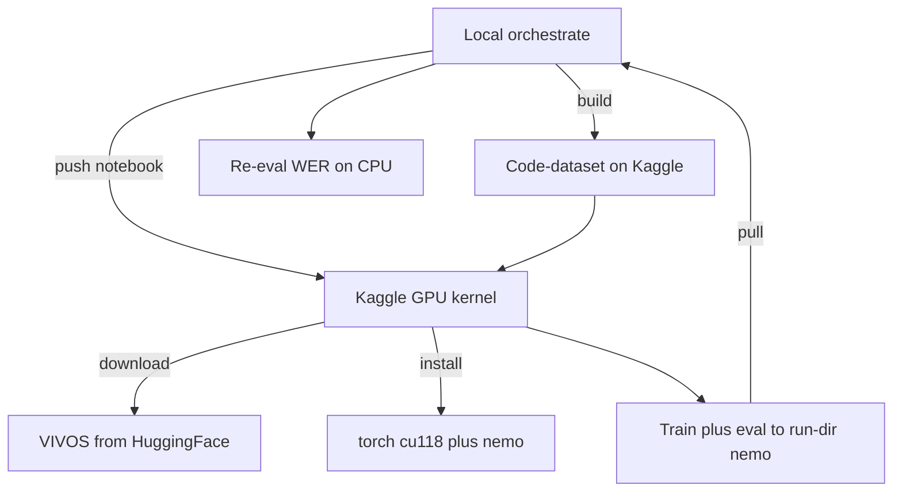

# Fine-tune ASR sang tiếng Việt bằng VIVOS trên Kaggle GPU — report

Báo cáo vòng lặp đầu tiên: **lấy model NeMo English-only → fine-tune sang tiếng Việt (VIVOS) trên
Kaggle GPU miễn phí → kéo model về đo lại WER**. Mục tiêu chính là **thông luồng** (dựng được cơ chế
train trên Kaggle vì máy local chỉ có CPU) và kiểm chứng fine-tune có giảm WER thật không.

> Đây là kết quả THÔNG LUỒNG + chứng minh cơ chế, không phải số leaderboard. VIVOS là giọng đọc
> sạch nên WER sẽ đẹp giả tạo so với callbot điện thoại thật.

---

## TL;DR (kết quả chính)

- Cơ chế **deploy Kaggle** (local điều phối, Kaggle train GPU, kéo artifact) chạy trọn vẹn.
- Model nền `stt_en_fastconformer_transducer_large` (115M, đúng cỡ kiến trúc VPB), English-only:
  - **WER trước fine-tune trên VIVOS: ~100,1%** (không biết tiếng Việt — toàn ra rỗng/tiếng Anh).
  - **WER sau fine-tune: 20,37%** (40 epoch / 27.800 step / ~3,8h trên Kaggle GPU). Đo lại trên
    **CPU local** bằng model kéo về: **cũng 20,37%** — khớp tuyệt đối, round-trip đáng tin.
- Model `nemotron-speech-streaming-en-0.6b` (Kỳ chọn ban đầu): **fine-tune kiểu đổi-vocab KHÔNG hội tụ**
  (loss kẹt mức ngẫu nhiên, model sụp về "luôn phát blank"). Để lại làm follow-up (xem §6).

> ⚠️ **Đặt đúng kỳ vọng: 20,37% mới là sàn "hello-world", CHƯA phải kết quả tốt.**
> VIVOS là tập **rất dễ**: thu phòng thu, ít nhiễu, ít người nói (read speech sạch). Hệ ASR tốt
> trên VIVOS đạt **WER ~3-5%**. Con số 20% của lần đầu vừa do **chưa hội tụ đủ** vừa do **bug lệch
> chuẩn hoá text** (`<unk>` ở chữ hoa — xem report lỗi của fast-conformer). Run kế tiếp đã **sửa bug
> chuẩn hoá + thêm cổng OOV**; mục tiêu kéo WER về vùng **một chữ số (< 10%, hướng 3-5%)**. Nếu vẫn
> kẹt cao thì bước sau là tăng epoch / augment / dùng encoder mạnh hơn — KHÔNG coi 20% là "đạt".

---

## Glossary

- **Fine-tune đổi-vocab (change_vocabulary):** model English-only không có token tiếng Việt → phải
  dựng lại bộ từ vựng (decoder + joint) theo BPE tiếng Việt rồi train. Encoder (rút đặc trưng âm) giữ lại.
- **RNNT:** kiểu giải mã transducer (encoder + prediction LSTM + joint). Mạnh nhưng tốn bộ nhớ khi train.
- **collapse-to-blank:** lỗi train RNNT phổ biến — model học "mẹo" luôn phát ký tự rỗng (blank) để giảm
  loss cục bộ rồi kẹt ở đó, WER = 100%.
- **WER / RTF:** tỉ lệ lỗi từ / thời gian xử lý chia thời lượng audio.
- **Code-dataset:** đóng gói thư mục `src/` thành 1 Kaggle dataset tí hon để kernel đọc code (thay vì
  clone GitHub) — không phụ thuộc `git push`.
- **P100 / sm_60:** GPU Kaggle cấp; "sm_60" là kiến trúc Pascal — torch bản mới (cu128) đã bỏ hỗ trợ.

---

## 1. Cơ chế deploy Kaggle (local điều phối — Kaggle train)

Máy local chỉ CPU → train trên Kaggle GPU miễn phí (P100/T4, ~30h/tuần, 4 account). Phỏng theo cơ
chế numerai `lab_v2/deployment/kaggle.py`, chế lại cho ASR.



- **Adapter:** `src/asr_lab/deploy/kaggle.py` — lệnh `accounts / build / smoke / push / poll / pull`.
- **Code lên kernel:** đóng gói `src/` thành code-dataset (`build`), kernel đọc từ `/kaggle/input`
  (không cần GitHub — tránh phụ thuộc `git push`).
- **Notebook sinh tự động:** định vị code → cài torch+nemo → chạy script → copy run-dir ra output.
- **Artifact:** run-dir (`status.json` + `results.json` + `.nemo` + `metrics.csv`) → `pull` đẩy về
  `artifacts/runs/<id>/`.

## 2. Cấu hình fine-tune

- **Model nền:** `nvidia/stt_en_fastconformer_transducer_large` (115M, FastConformer + RNNT, English-only).
- **Data:** VIVOS (`ademax/vivos-vie-speech2text`, mirror parquet) — train ~11.4k câu, test 1.000 câu.
- **Tokenizer:** BPE tiếng Việt 1024 (SentencePiece, `character_coverage=1.0` để phủ hết dấu).
- **Train:** full fine-tune (encoder mở), batch 16, lr 2e-4, cosine + warmup, precision 16-mixed,
  `max_steps` tính từ data (tránh LR sụp sớm), `max_time` chặn để luôn kịp eval+save trong khung Kaggle.
- **Script:** `asr_lab/train/finetune_vivos.py`. Đo WER bằng cùng harness `asr_lab/eval/vivos.py` (chuẩn hoá giữ dấu tiếng Việt).

## 3. Kết quả

| Giai đoạn                                 | WER trên VIVOS test | Ghi chú                                        |
| ------------------------------------------- | -------------------- | ----------------------------------------------- |
| Baseline (115M English-only)                | ~100,1%              | Chưa biết tiếng Việt — ra rỗng/tiếng Anh |
| Verify ngắn (~3.000 step)                  | 81,03%               | Đã học, loss giảm đều 107 → ~55          |
| **Full fine-tune — eval Kaggle GPU** | **20,37%**     | 40 epoch / 27.800 step / ~3,8h                  |
| **Full fine-tune — eval CPU local**  | **20,37%**     | Model kéo về, khớp tuyệt đối với GPU     |

RTF model fine-tuned trên CPU: ~0,058 (115M nhanh, nhẹ máy).

### Đường cong train (từ metrics.csv)

- **train_loss:** 470 → 122 (epoch 1) → 27 (epoch ~4) → 9 (epoch ~8) → 3 (epoch ~17) → ~0,7 (cuối).
- **val_wer (validation cắt từ train):** ~90% (epoch 2) → 32% (e6) → 24% (e10) → 19% (e19) →
  ~17,3% (e39). Plateau quanh 17% từ ~epoch 20 → epoch 20-40 lời ít; có thể dừng sớm hơn.
- **Overfit nhẹ:** train-batch WER chạm ~1-3% trong khi val ~17% — bình thường với VIVOS nhỏ + 40 epoch.

### Quan sát định tính (cặp ref/hyp thật)

```
REF: tuy nhiên ca ghép đã hoàn tất như dự kiến ông liêm nói
HYP: uy nhiên cây ghép đã hòn tấc như dự kiến ông iêm nói
REF: ăn ở có nhân có nghĩa          HYP: n ở có nhân có nghĩa
REF: những loại thực phẩm này       HYP: hững loại thực phẩm này
```

Model đã nghe ra tiếng Việt rõ ràng; lỗi đặc trưng = **"rớt ký tự/âm ĐẦU câu"** ("tuy"→"uy",
"ăn"→"n", "những"→"hững", "hai"→"ai") — đẩy WER lên, phần thân câu khá chuẩn. **Đã truy được
root-cause** (chi tiết: [03_fastconformer/01_vi_finetune_error_analysis.md](../03_models/03_fastconformer/01_vi_finetune_error_analysis.md)):
KHÔNG phải lỗi audio (đệm im lặng không sửa) mà là **tokenizer/manifest mismatch** — tokenizer build
từ text thường, nhưng nhãn train để RAW (chữ HOA + dấu câu) → chữ hoa đầu câu/danh từ riêng thành
`<unk>`. **Đã sửa code** (`prepare_data` normalize nhãn khớp tokenizer); cần train lại để xác nhận.

## 4. Nhật ký debug (giá trị thông luồng — các lỗi đã gặp + cách sửa)

Chuỗi lỗi khi đưa fine-tune NeMo RNNT lên Kaggle GPU (ghi để lần sau không vấp lại):

1. **`reload(torch)` crash** (double-register TORCH_LIBRARY triton) → KHÔNG import/reload torch
   trong kernel notebook; mọi việc đụng torch/nemo chạy trong **subprocess**.
2. **`git push` bị deny** (ranh giới no-auto-push) → chuyển GitHub-pull sang **code-dataset**.
3. **`no kernel image for sm_60`** trên P100: torch cu128 mặc định bỏ kiến trúc Pascal → cài
   **torch 2.7.1+cu118** (phủ sm_60 P100 + sm_75 T4).
4. **`torchvision::nms does not exist`**: lệch ABI sau khi hạ torch → cài kèm **torchvision 0.22.1+cu118**.
5. **CUDA OOM** (batch 16, model lớn + RNNT) → giảm **batch** (4-16 tùy model).
6. **LR cosine sụp về ~0 sớm** (không khai max_steps) → train đứng; sửa: tính **max_steps thật từ data**.
7. **Model streaming nemotron collapse-to-blank** → đổi sang model **offline 115M** (xem §6).

## 5. Hạn chế (không thổi phồng)

- VIVOS là giọng đọc sạch → WER đẹp giả tạo, KHÔNG phản ánh callbot điện thoại (8kHz, nhiễu).
- Chưa chọn checkpoint tốt nhất theo val (eval ở epoch cuối) → có thể chưa tối ưu.
- Tiếng Việt cho mục đích nghiên cứu (VIVOS license phi thương mại).

## 6. Về nemotron 0.6B (model Kỳ chọn ban đầu) — vì sao chưa dùng

`nemotron-speech-streaming-en-0.6b` là model **cache-aware streaming**. Khi fine-tune kiểu đổi-vocab:

- Loss kẹt ở mức ngẫu nhiên (~100), không giảm dù full hay freeze encoder, dù 1.600+ step.
- Model sụp về "luôn phát blank" → WER giữ 100%.
- Trái lại model offline 115M cùng recipe giảm loss đều và WER xuống 81% rất nhanh.

→ Kết luận: recipe đổi-vocab chuẩn hợp với model **offline**; model **streaming** cần cách fine-tune
riêng. Phân tích kiến trúc đầy đủ: [03_models/02_nemotron/04_vi_finetune_difficulty.md](../03_models/02_nemotron/04_vi_finetune_difficulty.md).

## 7. Hướng tiếp theo

- **[ĐANG CHẠY] Run v2 với fix chuẩn hoá + cổng OOV** (`vivos-fc115m-v2norm`) — khử `<unk>` chữ hoa
  (root-cause lỗi "rớt ký tự đầu", §3) + thêm `assert_no_oov` chặn lỗi trước khi tốn GPU. Mục tiêu
  kéo WER từ 20% về **một chữ số** (VIVOS SOTA ~3-5%). Config: 50 epoch, batch 16, vocab 1024, lr 2e-4,
  precision 32.
- Chọn **best-checkpoint theo val_wer** thay vì eval epoch cuối (tránh lấy đúng epoch overfit).
- Thử dataset khó hơn (Common Voice VI, FOSD) + tiến tới giọng điện thoại 8kHz cho callbot.
- Nếu cần model 0.6B: thử fine-tune **giữ vocab gốc** (model đa ngữ nemotron-3.5 có vi-VN) thay vì đổi-vocab.

## 8. Cách chạy lại (entrypoint dạng module — package `asr_lab`)

```bash
# 1. Đẩy code lên Kaggle (code-dataset) — BẮT BUỘC build lại sau mỗi lần sửa src/
uv run python -m asr_lab.deploy.kaggle build --account kyhoolee
# 2. Phóng full fine-tune GPU (model OFFLINE 115M; KHÔNG để default nemotron streaming)
uv run python -m asr_lab.deploy.kaggle push --account kyhoolee --gpu --as asr-ft-fc115m-v2norm \
  --module asr_lab.train.finetune_vivos --script-args \
  "--pretrained nvidia/stt_en_fastconformer_transducer_large --run-id vivos-fc115m-v2norm \
   --epochs 50 --batch 16 --vocab-size 1024 --lr 2e-4 --precision 32 --max-minutes 480"
# 3. Theo dõi + kéo về
uv run python -m asr_lab.deploy.kaggle poll --account kyhoolee --kernel asr-ft-fc115m-v2norm
uv run python -m asr_lab.deploy.kaggle pull --account kyhoolee --kernel asr-ft-fc115m-v2norm
# 4. Eval lại trên CPU local
uv run python -m asr_lab.eval.vivos --manifest data/manifests/vivos_test.jsonl \
  --model artifacts/runs/vivos-fc115m-v2norm/nemotron_vivos_ft.nemo
```

---

## ✅ Tự kiểm nhanh

1. Vì sao phải "đổi vocab" khi fine-tune model English sang tiếng Việt?

<details><summary>Đáp án</summary>

Model English-only có bộ từ vựng (tokenizer + lớp decoder/joint) chỉ cho tiếng Anh, không có token
biểu diễn chữ/âm tiếng Việt. Phải dựng lại tokenizer BPE tiếng Việt rồi thay decoder+joint
(`change_vocabulary`), giữ encoder để tận dụng năng lực rút đặc trưng âm.

</details>

2. "collapse-to-blank" là gì và dấu hiệu nhận biết?

<details><summary>Đáp án</summary>

Là khi model RNNT học mẹo luôn phát ký tự rỗng (blank) để giảm loss cục bộ rồi kẹt. Dấu hiệu:
loss giảm một chút rồi chững ở mức cao (~ mức ngẫu nhiên), WER giữ 100% (output rỗng).

</details>

3. Vì sao train trên Kaggle mà không train local?

<details><summary>Đáp án</summary>

Máy local chỉ có CPU; fine-tune model 0.1-0.6B cần GPU. Kaggle cho GPU miễn phí (P100/T4, ~30h/tuần).
Local chỉ điều phối (push code, kéo artifact) và eval lại bằng CPU trên tập test nhỏ.

</details>
