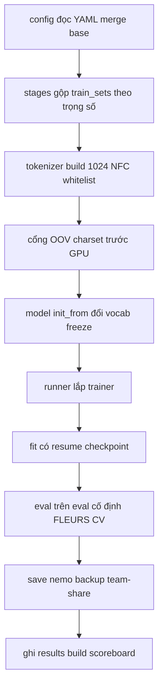

# 07.08 — Thiết kế hệ thống training mới (config-driven, mở rộng được)

- Code cũ (`finetune_vivos`/`continue_vi`) = **đóng băng** (record Kaggle flow-through).
- Code mới viết lại **bài bản**
  - logic training corpus lớn cần **tinh chỉnh nhiều lần** trong quá trình train/fine-tune
  - và **tuning tiếp khi có thêm dataset** tương lai.
- Thiết kế này rút kinh nghiệm các điểm pros/cons của code cũ.

---

## Glossary

- **Config-driven:** đổi hyperparam/data = sửa file YAML, KHÔNG sửa `.py`. Điều kiện để tinh chỉnh nhanh, nhiều lần.
- **Adapter (data):** khai báo cách đọc 1 nguồn (cột text, kiểu audio) — thêm dataset = thêm 1 entry, không sửa lõi.
- **Vertical slice (lát mỏng):** làm 1 luồng end-to-end chạy được sớm, rồi mới bồi thêm tầng.

---

## Cái dở của code cũ → nguyên tắc thiết kế mới

| Code cũ (Kaggle-era)                                        | Hệ mới                                                                   |
| ----------------------------------------------------------- | ------------------------------------------------------------------------ |
| Hardcode 1-2 dataset trong`prepare_data`/`prepare_combined` | **Config liệt kê train_sets + trọng số**, thêm bộ không sửa code         |
| Hyperparam qua ~15 flag CLI rời                             | **1 file YAML/experiment** (inherit `_base`), snapshot vào run-dir       |
| Pull HF mỗi run, wav ra /tmp                                | Đọc**snapshot local + tarred** ([04](04_data_normalization_manifest.md)) |
| `enable_checkpointing=False`, save 1 lần cuối               | **ModelCheckpoint top-k + resume** ([07](07_training_lifecycle.md))      |
| eval baked-in, 2×2 cứng                                     | **Eval set cố định khai báo trong config**, tách hàm                     |
| Sửa code = rủi ro luồng Kaggle                              | Package**riêng** `train/vi/`, không đụng cũ                              |

**Nguyên tắc:**

- (1) config over code;
- (2) thêm dataset = khai báo, không sửa lõi;
- (3) fail-fast gates giữ nguyên (OOV/charset trước GPU);
- (4) mọi run reproducible (snapshot config + git sha + hash manifest);
- (5) preemptible (checkpoint đều);
- (6) **tái sử dụng tối đa** (Lightning + NeMo + OmegaConf + registry sẵn).

---

## Bố cục package (mới, tách khỏi code cũ đóng băng)

```
src/asr_lab/
  common/metrics.py        # LÕI (giữ) — normalize_vi (vá NFC), wer, extract_text
  common/models.py         # LÕI (giữ) — danh sách model nền
  data/
    vivos.py common_voice.py   # cũ, GIỮ (lõi to_16k_mono tái dùng)
    build_corpus.py            # MỚI — adapter registry -> manifest + stats ([04])
    stages.py                  # MỚI — gộp train_sets + trọng số -> manifest stage
  train/
    finetune_vivos.py continue_vi.py   # ĐÓNG BĂNG (Kaggle-era)
    vi/                        # MỚI — hệ training DGX
      config.py                #   load+merge YAML (OmegaConf) + validate + snapshot
      tokenizer.py             #   build tokenizer 1024 từ multi-manifest (NFC, whitelist)
      model.py                 #   init_from / change_vocabulary / add_ctc_head / freeze
      callbacks.py             #   ModelCheckpoint, EMA, LRMonitor
      runner.py                #   lắp trainer -> fit(resume) -> eval -> save+backup -> results.json
      __main__.py              #   CLI: python -m asr_lab.train.vi --config ...
  eval/ registry/            # GIỮ — build_scoreboard đọc results.json (mở rộng schema)
configs/                     # MỚI — YAML mỗi experiment
  _base.yaml  s1_clean.yaml  s2_natural.yaml  s3_full.yaml
```

---

## Config schema (linh hồn hệ thống)

`configs/_base.yaml` (mặc định chung) + file nấc chỉ override phần khác. OmegaConf merge (đã có qua NeMo, không thêm dep).

```yaml
run:
  {
    id: null,
    stage: null,
    artifacts_dir: artifacts,
    backup_dir: /srv/team-share/models/asr_vi,
  }
model:
  init_from: nvidia/stt_en_fastconformer_transducer_large # hoặc .nemo nấc trước
  change_vocabulary: true # nấc đầu true; resume nấc sau false
  add_ctc_head: false # hybrid bật sau
  tokenizer: { dir: null, vocab_size: 1024, type: bpe } # dir=null -> build mới
data:
  root: /srv/team-share/datasets/asr_vi
  eval_fixed: [fleurs_vi_test, cv_test] # KHÔNG train
  train_sets: # thêm dataset = thêm 1 dòng
    - { name: vivos, weight: 3.0 } # upsample tập sạch nhỏ (replay)
    - { name: common_voice_vi, weight: 3.0 }
    - { name: fleurs_vi, weight: 3.0 }
    - { name: infore1, weight: 1.0 }
  filter: { min_dur: 0.3, max_dur: 30.0, whitelist_max_oov: 0.01 }
optim:
  {
    name: adamw,
    lr: 1.0e-4,
    weight_decay: 1.0e-3,
    sched: { name: CosineAnnealing, warmup_steps: auto, min_lr: 1.0e-6 },
  }
train:
  {
    batch_size: 32,
    accum_grad: 8,
    epochs: 30,
    precision: bf16-mixed,
    max_minutes: 480,
    bucketing: true,
    spec_augment: { freq_masks: 2, time_masks: 8 },
  }
checkpoint: { save_top_k: 3, monitor: val_wer, every_n_steps: 2000, ema: 0.999 }
```

`s2_natural.yaml` chỉ cần: `run.stage=s2`, `model.init_from=<.nemo s1>`, `model.change_vocabulary=false`, thêm FOSD/VLSP/LSVSC vào `train_sets`, `optim.lr=5.0e-5`, `train.epochs=8`.

---

## Trách nhiệm từng module (1 việc/module)

| Module         | Vào            | Ra                   | Việc                                                                  |
| -------------- | -------------- | -------------------- | --------------------------------------------------------------------- |
| `config.py`    | YAML           | cfg đã validate      | merge`_base`+exp, kiểm hợp lệ, snapshot `run-dir/config.yaml`+git sha |
| `stages.py`    | cfg.data       | train/val manifest   | gộp train_sets theo trọng số, giải tarred, tách val                   |
| `tokenizer.py` | manifest gộp   | `tokenizer_vi_1024/` | build SP-BPE (NFC+whitelist), cổng OOV                                |
| `model.py`     | cfg.model      | model NeMo           | from_pretrained/restore, change_vocabulary, add CTC, freeze           |
| `callbacks.py` | cfg.checkpoint | list callback        | ModelCheckpoint top-k, EMA, LRMonitor                                 |
| `runner.py`    | tất cả         | `.nemo`+results.json | fit(resume) → eval fixed → save+backup → registry                     |

---

## Luồng 1 experiment



---

## Thêm dataset tương lai (3 bước, không sửa lõi)

1. Thêm entry vào `tools/pull_datasets/datasets.yaml` → `pull.py` kéo về.
2. Thêm 1 dòng adapter (cột text/audio) vào `build_corpus.ADAPTERS` nếu schema lạ.
3. Thêm `{name, weight}` vào `train_sets` của config nấc muốn dùng → chạy lại.

## Chạy / resume / sang nấc

- Chạy: `python -m asr_lab.train.vi --config configs/s1_clean.yaml`
- Resume giữa run (bị kill): `--resume artifacts/runs/<id>/checkpoints/last.ckpt`
- Sang nấc mới: dùng config nấc sau (`init_from=.nemo` nấc trước) — experiment mới.

---

## Chống over-engineer (không làm gì)

KHÔNG dựng: Hydra multirun, custom Trainer, plugin-system, DB experiment, abstraction "framework".
Tái dùng thẳng: Lightning Trainer + NeMo model + OmegaConf + `registry.build_scoreboard` + convention
`experiments/<NN>/{spec,RESULT}.md` sẵn có.

## Lộ trình lát mỏng (chạy được sớm, không vẽ suông)

- **Slice 0** (rẻ, không train): vá `normalize_vi` NFC + test; `inspect_arch` xác nhận model nền thật.
- **Slice 1**: `config.py`+`model.py`+`runner.py` tối thiểu → chạy **S1-tiny** (2 bộ nhỏ, 50 step) end-to-end trên DGX **có checkpoint + resume**. Chứng minh khung chạy trước khi bồi.
- **Slice 2**: `build_corpus`+`stages` (multi-dataset + trọng số) + tarred bộ lớn.
- **Slice 3**: `tokenizer` 1024 rebuild + chạy **S1 thật**, đo throughput chốt batch/epoch.
- **Slice 4**: EMA + hybrid CTC head + nấc S2/S3.

## ✅ Tự kiểm nhanh

1. Vì sao config-driven quan trọng cho việc này? 2. Thêm dataset mới cần sửa lõi không? 3. Vì sao làm slice-1 tiny trước?

<details><summary>Đáp án</summary>
1. Training corpus lớn cần tinh chỉnh nhiều lần + tuning tiếp khi thêm data → đổi YAML nhanh, không sửa/mạo hiểm code.
2. Không — thêm entry pull + adapter + 1 dòng train_sets. 3. Chứng minh khung end-to-end (fit+checkpoint+resume+eval) chạy được trên GB10 trước, tránh vẽ kiến trúc lớn mà chưa có bước nào chạy.
</details>
