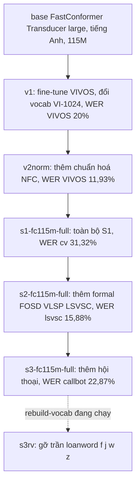
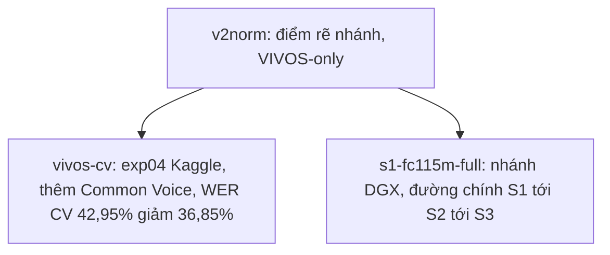

# 07.09 — Split dữ liệu, chiến lược đánh giá, và lineage model

Hình dung một buổi họp lab:
- một người báo "model mới đạt WER 16%", một người khác báo "bản của tôi 33%".
- Cùng một model gia phả, vì sao hai con số lệch gấp đôi?
- Câu trả lời gần như luôn là: **hai người đo trên hai tập test khác nhau**, hoặc nhầm giữa con số dùng để *chọn checkpoint* với con số dùng để *báo cáo*.

> Tài liệu này là bản đồ chống nhầm lẫn cho toàn bộ pipeline ASR tiếng Việt trên DGX.
>
> Mục tiêu là để bất kỳ ai — kể cả chính chúng ta ba tháng sau — đọc một con số WER và biết ngay: đo trên tập nào, model nào, đã đi qua chuỗi train-set nào.

Số liệu trong bài lấy từ manifest thật (`_manifests/*.stats.json`), cập nhật 2026-07-02.

---

## Glossary

- `WER` → **Word Error Rate** → tỉ lệ lỗi từ; càng thấp càng tốt.
- `Train` → **tập huấn luyện** → model học trực tiếp trên đây.
- `Val` → **tập validation** → model KHÔNG học, nhưng nhìn *gián tiếp* vì ta dùng để chọn checkpoint tốt nhất.
- `Test` → **tập kiểm tra** → model chưa từng thấy; chỉ dùng đo cuối cùng để so sánh công bằng.
- `official split` → **bộ chia sẵn** → dataset đã kèm sẵn ranh giới train/val/test của tác giả.
- `cut-tail` → **cắt đuôi** → tự cắt 5% cuối tập train làm val khi dataset không có val sẵn.
- `upsample` → **nhân bản có trọng số** → lặp lại clip của tập sạch nhỏ để tập lớn không lấn át.
- `held-out` → **tách riêng** → phần dữ liệu gỡ hẳn khỏi train, model không bao giờ nhìn thấy.
- `lineage` → **gia phả model** → chuỗi checkpoint kế thừa nhau từ base tới nấc hiện tại.
- `S1 / S2 / S3` → **ba nấc curriculum** → dễ đến khó: đọc sạch → đọc đa nguồn → hội thoại/bulk.

---

## 1. Ba vai của dữ liệu — vì sao phải tách bạch

Trước khi nói con số, phải hiểu mỗi clip audio đóng vai nào. Ba vai này khác nhau về bản chất, không được trộn.

- **Train:**
  - ⚙️ **Cơ chế:** model cập nhật trọng số trực tiếp từ các clip này.
  - 🔍 **Nhận diện:** file `<name>.train.jsonl`.
  - 💡 **Ý nghĩa:** quyết định model học được gì.

- **Val:**
  - ⚙️ **Cơ chế:** sau mỗi chặng, đo WER trên val để **chọn checkpoint** giữ lại; model không học từ val.
  - 🔍 **Nhận diện:** file `<name>.val.jsonl`, hoặc phần cut-tail 5% của train.
  - 💡 **Ý nghĩa:** là "giám khảo nội bộ" trong một lần train.
  - ⚠️ **Bẫy:** val đổi theo từng nấc (mỗi nấc thêm dataset mới) → **không được** dùng val để so giữa các nấc.

- **Test:**
  - ⚙️ **Cơ chế:** đo một lần ở cuối, trên dữ liệu model chưa từng thấy.
  - 🔍 **Nhận diện:** file `<name>.test.jsonl`, cố định xuyên mọi nấc.
  - 💡 **Ý nghĩa:** thước đo công bằng duy nhất để so sánh model với model.
  - ⚠️ **Bẫy:** nếu test lẫn vào train (rò rỉ), con số đẹp giả tạo và vô nghĩa.

Hai cách có được val/test, phân biệt rõ:
- **official split** — dataset kèm sẵn ranh giới của tác giả:
  - đáng tin nhất vì thường tách theo người nói.
  - Trong corpus này chỉ **Common Voice** và **FLEURS** có đủ bộ ba train/val/test; **VIVOS** có train/test.
- **cut-tail** — tự cắt 5% cuối train làm val:
  - dùng cho bộ chỉ có train.
  - Yếu hơn official vì val kiểu này **cùng phân phối** với train, không phản ánh được dữ liệu lạ.

---

## 2. Split thực tế của từng dataset

Bảng dưới đọc thẳng từ manifest. Cột "Nấc" cho biết dataset thuộc chặng curriculum nào.

| Dataset | Nguồn HF (phiên bản) | Train | Val | Test | Giờ | Nấc |
| --- | --- | --- | --- | --- | --- | --- |
| vivos | `ademax/vivos-vie-speech2text` (mirror VIVOS gốc) | 11.420 | cut-tail | **1.000** | ~15,7 | S1 |
| common_voice_vi | `tsdocode/common_voice_13_0_vi_pseudo_labelled` (CV13) | 2.462 | **392** | **1.225** | ~5,7 | S1 |
| fleurs_vi | `google/fleurs` config `vi_vn` | 2.984 | **356** | **844** | ~13 | S1 |
| infore1 | `doof-ferb/infore1_25hours` | 14.934 | cut-tail | — | ~25 | S1 |
| fosd | `doof-ferb/fpt_fosd` | 25.913 | cut-tail | **1.000** carve | ~30,2 | S2 |
| vlsp2020_100h | `doof-ferb/vlsp2020_vinai_100h` (mirror VLSP2020-VinBigData) | 56.172 | cut-tail | **1.000** carve | ~98,7 | S2 |
| lsvsc | `doof-ferb/LSVSC` | 51.139 | **5.682** | **1.000** carve | ~100,7 | S2 |
| bud500 / infore2 / vietsuperspeech | đang pull | — | — | — | — | S3 |

Ghi chú phiên bản, để không nhầm nguồn:
- **Common Voice** ở đây là bản **CV13 mirror pseudo-labelled**, KHÔNG phải CV17:
  - cột transcript thật là `sentence`.
  - Cột `whisper_transcript` là nhãn-giả sinh bởi Whisper — đã BỎ, không dùng.
- **VLSP** là **mirror của doof-ferb** cho VLSP2020-VinBigData:
  - dùng mirror để né form đăng ký của bản gốc.
- Chỉ **Common Voice** và **FLEURS** có bộ ba official đầy đủ; các bộ còn lại chủ yếu chỉ có train (riêng LSVSC có thêm val).

---

## 3. Hai loại con số WER — đừng lẫn

Đây là chỗ gây nhầm nhiều nhất. Có đúng hai loại con số, mỗi loại trả lời một câu hỏi khác nhau.

- **`val_wer` — con số CHỌN checkpoint:**
  - ⚙️ **Cơ chế:** đo trên val của *chính run đó* (gộp val các train-set trong run), sau mỗi chặng.
  - 🔍 **Nhận diện:** xuất hiện trong log training và tên checkpoint.
  - 💡 **Ý nghĩa:** chỉ để trả lời "trong run này, epoch nào tốt nhất?".
  - ⚠️ **Bẫy:** val đổi thành phần theo từng nấc → **cấm** so `val_wer` giữa nấc S1 với S2.

- **Test WER — con số BÁO CÁO:**
  - ⚙️ **Cơ chế:** đo trên suite test cố định, giữ nguyên xuyên mọi nấc.
  - 🔍 **Nhận diện:** ghi trong `RESULT.md` của từng run.
  - 💡 **Ý nghĩa:** thước đo duy nhất để so nấc-với-nấc, model-với-model.
  - ⚠️ **Bẫy:** phải cùng một tập test thì so sánh mới có nghĩa; đổi test là đổi câu hỏi.

Quy tắc rút gọn:
- Muốn biết **run này chọn epoch nào** → nhìn `val_wer`.
- Muốn **so S1 với S2 hay với model khác** → luôn nhìn Test WER trên suite cố định.

---

## 4. Suite nhiều tập test — mỗi tập trả lời một câu hỏi

Nguyên tắc Kỳ chốt, gồm hai vế:
- **Bắt buộc held-out** — test phải gỡ hẳn khỏi train, model không bao giờ nhìn thấy.
- **Nhiều test là bình thường** — mỗi tập có đặc thù riêng, nên trả lời câu hỏi khác nhau; gộp làm một sẽ mất thông tin.

| Tập test | Nguồn | Held-out | Đặc thù | Câu hỏi nó trả lời |
| --- | --- | --- | --- | --- |
| `vivos_test` | official, 1.000 | ✔ | đọc studio | Có quên VIVOS gốc không? |
| `cv_test` | official, 1.225 | ✔ | đọc crowdsource, mic đa dạng | Đọc mic đời thường tốt không? |
| `fleurs_test` | official, 844 | ✔ | đọc studio chuẩn | So với benchmark quốc tế thế nào? |
| `vlsp_test` | carve 1.000, ~1,83h | ✔ | đọc tin tức formal | Giọng đọc trang trọng ra sao? |
| `lsvsc_test` | carve 1.000, ~1,69h | ✔ | tự nhiên, đa vùng miền/cảm xúc | Nói tự nhiên nhẹ, robust vùng miền? |
| `fosd_test` | carve 1.000, ~1,2h | ✔ | đọc nguồn FPT | Chất lượng trên nguồn FPT? |
| `vietsuperspeech_test` | carve khi build S3 | ⏳ | hội thoại podcast/phỏng vấn | **Gần callbot nhất — câu hỏi FCI** |
| `bud500_test` | carve khi build S3 | ⏳ | tự nhiên bulk 3 miền | Robust vùng miền + nói tự nhiên? |

Khái niệm **carve** giải thích ba lớp:
- ⚙️ **Cơ chế:** với bộ không có test official, tool `asr_lab.data.carve_test` sort clip theo đường dẫn (tất định), lấy N clip cuối làm test và **gỡ khỏi** train.
- 🔍 **Nhận diện:** sinh ra file `<name>.test.jsonl`, đồng thời train giảm đúng N dòng.
- 💡 **Ý nghĩa:** tạo được thước đo held-out cho các domain S2/S3 mà dataset gốc không kèm test.
- ⚠️ **Bẫy:** các bộ HF này không có nhãn người nói → carve ở mức clip, **không** đảm bảo tách tuyệt đối theo người nói; chấp nhận làm test đại-diện-domain, muốn chặt hơn phải có nhãn speaker.

Đã carve xong S2 (vlsp, lsvsc, fosd). S3 sẽ carve ngay sau khi `build_corpus` xong, và luôn TRƯỚC khi train.
Suite khai báo trong `configs/_base.yaml` mục `eval_fixed`; runner đo hết, file S3 chưa có thì bỏ qua an toàn.

> Lỗ hổng còn lại nằm ở Val, không giải được bằng carve.
>
> Val đổi thành phần theo nấc, nên `val_wer` chỉ dùng chọn checkpoint.
>
> So sánh giữa các nấc luôn phải quay về suite test cố định ở trên.

---

## 5. Lineage model — gia phả các checkpoint

### 5.1 Khung đọc sơ đồ

- **Đề bài:** mỗi checkpoint kế thừa từ đâu, và đã học thêm dataset nào?
- **Giả định:** mỗi mũi tên đặc = một lần fine-tune thật đã chạy (có số WER cuối); mũi tên đứt = nấc đang chạy, chưa có số cuối.
- **Cách đọc:** đi từ trên xuống theo trục dọc; nhánh rẽ tách ở nút `v2norm`.
- **Con số trong nhãn** là WER đã đo, để thấy chất lượng tăng dần qua các đời.

### 5.2 Đường xương sống S1 → S2 → S3

### 5.3 Điểm rẽ nhánh tại v2norm

Chỗ dễ nhầm nhất: run trên DGX **không** kế thừa nhánh Kaggle. Tách riêng cho rõ.

- **`s1-fc115m-full` continue từ `v2norm`** (VIVOS-only), KHÔNG từ `vivos-cv` của exp04:
  - nghĩa là nó **thêm lại Common Voice** như một phần của S1.
  - Không kế thừa phần training CV mà exp04 đã làm trên Kaggle.
- **Nhánh `vivos-cv` (exp04)** là nhánh song song trên Kaggle:
  - nằm ngoài đường chính S1 → S2 → S3.
  - Giữ lại chỉ để đối chiếu, không nối tiếp vào DGX.

### 5.4 Tokenizer trong gia phả

- **`s1-fc115m-full` giữ tokenizer của `v2norm`** (charset VIVOS, `change_vocabulary=false`), kế thừa nguyên tới S2/S3:
  - đo thật trên tokenizer S3: **0 token** chứa `f/j/w/z` → mọi loanword (wifi, facebook, zalo…) sinh `<unk>`.
  - đo tần suất nhãn test có `f/j/w/z`: **callbot 34,1%**, fleurs 13,4%, vlsp 9,4% → trần WER thật ở domain hội thoại/formal.
- **Nhánh `s3rv` rebuild-vocab (ĐANG chạy):**
  - `change_vocabulary=true` → build tokenizer mới trên corpus S3 (đã có `f/j/w/z` từ viVoice), continue từ `s3-fc115m-full`.
  - cổng OOV bản mới: `0,0000%` (1/17,7 triệu token) → trần loanword được gỡ ở tầng tokenizer.
  - encoder S3 giữ nguyên; decoder+joint dựng lại học vocab đủ chữ; mix train y hệt S3 để không regression.
  - Chi tiết quyết định: xem [03_tokenizer_vocab.md](03_tokenizer_vocab.md) mục QĐ-2.

---

## 6. Nấc gốc curriculum — `s1-fc115m-full`

> Trạng thái: S1 → S2 → S3 **đã chạy xong** (số cuối ở `experiments/05..07/RESULT.md`); nhánh `s3rv` rebuild-vocab đang chạy.
> Phần dưới giữ lại chi tiết nấc gốc S1 để truy nguồn curriculum.

- Số chính xác, giả thuyết và tiêu chí nghiệm thu: xem [`experiments/05_s1_fc115m_full/spec.md`](../../experiments/05_s1_fc115m_full/spec.md).
- Tóm tắt cấu hình:
  - Train 30.483 clip unique, thành 63.073 dòng sau upsample ×3 cho vivos/cv/fleurs.
  - Val 2.065 clip; test cố định `cv_test` + `fleurs_test`.
  - Parent `vivos-fc115m-v2norm.nemo`; 20 epoch, lr 1e-4 cosine, bf16-mixed.
- ⚠️ Run này snapshot eval **cũ** (chỉ cv + fleurs) → `RESULT.md` của nó chỉ có hai con số đó:
  - suite đầy đủ áp dụng từ các run sau (S2 trở đi).
  - Có thể chạy eval-lại `s1` trên suite mới để bổ sung tranh cross-domain.

---

## ✅ Tự kiểm nhanh

1. `val_wer` có dùng để so giữa các nấc được không, vì sao?
2. Muốn đo model gần với tình huống callbot nhất thì nhìn tập test nào?
3. `s1-fc115m-full` continue từ checkpoint nào, và có thừa hưởng training Common Voice của exp04 không?

Đáp án

1. KHÔNG — val đổi thành phần theo từng nấc, nên `val_wer` chỉ dùng chọn checkpoint trong một run; so nấc phải dùng suite test cố định.
2. `vietsuperspeech_test` (hội thoại) — gần callbot nhất; sau S3 (4 epoch) đo được **22,87%** (từ 40,00% ở S2).
3. Continue từ `v2norm` (VIVOS-only); KHÔNG thừa hưởng CV của exp04 — nó thêm lại Common Voice như một phần của S1.

