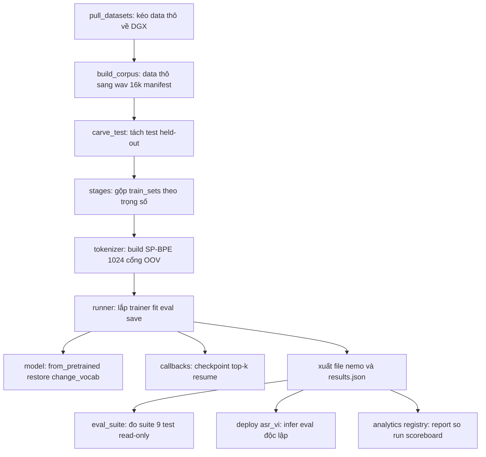

# 08.00 — Bản đồ module & guide chạy (train · load · infer)

Doc này trả lời hai câu hỏi khi mở repo `nvidia_asr_nemo`:

1. **Có những module nào, cái nào còn dùng được / chạy được?** (để review)
2. **Chạy 3 luồng chính thế nào?** — `train` (huấn luyện), `load` (nạp model), `infer` (nhận dạng / đo WER).

Doc bổ trợ, KHÔNG lặp:

- Thiết kế hệ training (vì sao config-driven, schema YAML): [07/08_new_system_design](../07_dgx_training/08_new_system_design.md).
- Data split + eval + gia phả checkpoint: [07/09_splits_eval_lineage](../07_dgx_training/09_splits_eval_lineage.md).
- Package bàn giao chạy độc lập: [`deploy/asr_vi/README.md`](../../deploy/asr_vi/README.md).

---

## Glossary

- **Entry point:** file chạy trực tiếp được bằng `python -m asr_lab.<...>` (có `main()` / khối `__main__`).
- **`.nemo`:** 1 file gói trọn 1 model NeMo (trọng số + config + tokenizer). Nạp bằng `restore_from`.
- **pretrained name:** tên model trên NGC/HuggingFace (vd `nvidia/stt_en_...`). Nạp bằng `from_pretrained`.
- **manifest (`.jsonl`):** mỗi dòng 1 clip: `{"audio_filepath","duration","text"}`. Đơn vị vào của train/eval.
- **eval_fixed / suite:** tập test CỐ ĐỊNH khai báo trong config, KHÔNG train, mỗi test trả lời 1 câu hỏi domain.
- **ĐÓNG BĂNG (frozen):** code thời Kaggle giữ lại để truy nguồn, KHÔNG phát triển tiếp (không sửa).

---

## 1. Bản đồ tầng repo

Chia theo trách nhiệm, đọc từ trên (chuẩn bị data) xuống dưới (bàn giao).



### 1.1 Nhóm module & trạng thái

| Nhóm                  | Module                                                                   | Trạng thái                         | Chạy trực tiếp?              |
| --------------------- | ------------------------------------------------------------------------ | ---------------------------------- | ---------------------------- |
| **Lõi dùng chung**    | `common/metrics.py` (normalize_vi, wer, extract_text)                    | active                             | không (thư viện)             |
|                       | `common/models.py` (danh sách model English bench)                       | active                             | không                        |
| **Chuẩn bị data**     | `tools/pull_datasets/pull.py`                                            | active                             | có (kéo data)                |
|                       | `data/build_corpus.py` (adapter registry)                                | active                             | có                           |
|                       | `data/carve_test.py` (tách test held-out)                                | active                             | có                           |
|                       | `data/build_tarred.py` (đóng tarred tăng throughput)                     | active                             | có                           |
|                       | `data/vivos.py` `common_voice.py` `librispeech.py` `hf_testset.py`       | active (lõi`to_16k_mono` tái dùng) | có                           |
| **Train (DGX, mới)**  | `train/vi/{config,stages,tokenizer,model,callbacks,runner}.py`           | active                             | không (gọi qua`__main__`)    |
|                       | `train/vi/__main__.py` (CLI train)                                       | active                             | **có**                       |
| **Train (đóng băng)** | `train/finetune_vivos.py` `train/continue_vi.py`                         | ĐÓNG BĂNG (Kaggle-era)             | có nhưng không phát triển    |
| **Load / soi**        | `model/inspect_arch.py` (đếm param, in cây layer)                        | active                             | **có**                       |
| **Infer / eval**      | `eval/smoke.py` (1 wav, pretrained)                                      | active                             | **có**                       |
|                       | `eval/vivos.py` (WER 1 manifest, nhận `.nemo`)                           | active                             | **có**                       |
|                       | `eval_suite.py` (suite eval_fixed trên `.nemo`)                          | active                             | **có**                       |
|                       | `eval/bench.py` `eval/sweep.py` (bench đa-model English)                 | active                             | có (English)                 |
| **Bàn giao độc lập**  | `deploy/asr_vi/{infer,eval_wer}.py`                                      | active                             | **có** (không cần `asr_lab`) |
|                       | `deploy/kaggle.py`                                                       | ĐÓNG BĂNG (Kaggle flow)            | có nhưng không phát triển    |
| **Sổ cái run**        | `analytics/{report,compare,verdict}.py` · `registry/build_scoreboard.py` | active                             | có (đọc results.json)        |

> Quy ước: **nhánh chính hiện tại = `train/vi/` + `configs/` + `deploy/asr_vi/`.**
> `finetune_vivos`/`continue_vi`/`deploy/kaggle` giữ để truy nguồn luồng Kaggle, không sửa (xem [07/08](../07_dgx_training/08_new_system_design.md)).

---

## 2. Luồng TRAIN

- **Mục đích:** huấn luyện / fine-tune 1 nấc curriculum, xuất `.nemo` + `results.json`.
- **Vào:** 1 file config nấc (merge `_base.yaml`). **Ra:** `<artifacts_dir>/runs/<id>/` (`.nemo`, checkpoints, results.json) + backup `/srv/team-share/models/asr_vi/`.
- **Thiết kế chi tiết + schema config:** [07/08_new_system_design](../07_dgx_training/08_new_system_design.md). Ở đây chỉ tóm chuỗi module + lệnh.

**Chuỗi module (1 experiment):**

- **`config.py`** — nạp + merge `_base.yaml` ← file nấc ← `--set` dotlist, validate, snapshot `config.yaml` + git sha vào run-dir.
- **`stages.py`** — gộp `train_sets` (upsample theo `weight`, subsample theo `cap`), tách val 5% nếu bộ không có val, map `eval_fixed`.
- **`tokenizer.py`** — chỉ khi `change_vocabulary=true` + chưa có `tokenizer.dir`: build SP-BPE 1024 trên train gộp, **cổng OOV** chặn `<unk>` trước GPU.
- **`model.py`** — `from_pretrained` (tên NGC/HF) hoặc `restore_from` (`.nemo` nấc trước); `change_vocabulary`; `freeze_encoder`; đẩy về `cuda`.
- **`callbacks.py`** — `ModelCheckpoint` top-k theo `val_wer` + `save_last` (để resume), LR monitor, EMA tuỳ chọn.
- **`runner.py`** — eval TRƯỚC → `trainer.fit(resume)` → eval SAU trên `eval_fixed` → `save_to(.nemo)` + backup → `results.json`.

**Lệnh:**

```bash
# chạy 1 nấc
python -m asr_lab.train.vi --config configs/s1_clean.yaml

# resume GIỮA run (bị kill / hết giờ) — chú ý bẫy max_time, xem lưu ý dưới
python -m asr_lab.train.vi --config configs/s3_conversational.yaml \
    --resume artifacts/runs/<id>/checkpoints/last.ckpt

# override nhanh khi smoke
python -m asr_lab.train.vi --config configs/s1_clean.yaml \
    --set train.epochs=1 train.batch_size=2 eval_limit=4
```

> ⚠️ **Bẫy resume:** Lightning lưu đồng hồ `max_time` VÀO checkpoint. Resume mà giữ nguyên `train.max_minutes`
> cũ → dừng ngay, không train. Fix = nâng `max_minutes` khi resume (đặt dư hơn thời gian đã tích).

---

## 3. Luồng LOAD

- **Mục đích:** nạp 1 model vào bộ nhớ để soi hoặc suy luận. Hai cách vào, dùng chung ở mọi script.
- **Logic gốc:** `train/vi/model.py::load_model` (bản đầy đủ nhất). `eval/vivos.py` và `deploy/asr_vi/infer.py` có bản rút gọn cùng nguyên tắc.

**Hai cách nạp:**

- **`from_pretrained(model_name=...)`** — model có tên trên NGC/HuggingFace (vd `nvidia/stt_en_fastconformer_transducer_large`). Dùng cho model nền / benchmark.
- **`restore_from(path=....nemo)`** — 1 file `.nemo` local (checkpoint nấc trước / bản bàn giao). Dùng cho mọi model đã train ở lab.
- **Quy tắc nhận diện** (dùng ở nhiều script): đuôi `.nemo` hoặc path tồn tại → `restore_from`; ngược lại → `from_pretrained`.

**Hai điểm phải nhớ:**

- **`map_location`** — `"cpu"` để nạp trên máy không GPU; `"cuda"` khi có GPU.
- **Sau `change_vocabulary`** decoder/joint dựng MỚI trên CPU trong khi encoder ở cuda → phải `model.cuda()` lại,
  nếu không lệch device khi eval/transcribe (bug từng gặp ở GPU smoke).

**Soi kiến trúc (load + đếm param, không cần audio):**

```bash
python -m asr_lab.model.inspect_arch --model nvidia/stt_en_conformer_ctc_small
# in cây layer + bảng tham số + tách param theo preprocessor/encoder/decoder/joint
```

---

## 4. Luồng INFER (thang bậc — chọn theo nhu cầu)

Cùng lõi `model.transcribe(paths, batch_size=...)`; khác nhau ở input, có đo WER không, có phụ thuộc `asr_lab` không.

| Script                          | Vào                      | Ra                                   | Nhận`.nemo`?           | Khi nào dùng                               |
| ------------------------------- | ------------------------ | ------------------------------------ | ---------------------- | ------------------------------------------ |
| `eval/smoke.py`                 | 1 wav                    | text                                 | KHÔNG (chỉ pretrained) | thông luồng "tải + infer chạy được"        |
| `eval/vivos.py`                 | 1 manifest               | WER + RTF + mẫu ref/hyp              | **có**                 | đo nhanh 1 model trên 1 tập VI             |
| `eval_suite.py`                 | `.nemo` + config         | WER cả suite`eval_fixed`             | **có**                 | tái tạo bảng 9 test 1 checkpoint           |
| `deploy/asr_vi/infer.py`        | wav / thư mục / manifest | text (kèm WER nếu manifest có`text`) | **có**                 | bàn giao độc lập, không cần repo train     |
| `deploy/asr_vi/eval_wer.py`     | nhiều manifest           | bảng WER + RTF                       | **có**                 | bàn giao độc lập, đo suite                 |
| `eval/bench.py` `eval/sweep.py` | nhiều model × test       | ma trận WER/RTF                      | pretrained             | benchmark English (dùng`common/models.py`) |
| `runner.eval_wer` (hàm)         | manifest                 | WER                                  | —                      | nội bộ train (eval TRƯỚC/SAU)              |

**Lệnh mẫu:**

```bash
# (a) infer cơ bản 1 wav bằng model đã train (in đúng 1 dòng text)
PYTHONPATH=deploy/asr_vi python deploy/asr_vi/infer.py \
    --nemo /srv/team-share/models/asr_vi/s3-fc115m-full.nemo --audio mau.wav

# (b) đo WER 1 tập VI bằng harness trong repo (nhận .nemo hoặc tên pretrained)
python -m asr_lab.eval.vivos --manifest <test>.jsonl \
    --model /srv/team-share/models/asr_vi/s3-fc115m-full.nemo --batch 8

# (c) đo cả suite eval_fixed 1 checkpoint
python -m asr_lab.eval_suite --nemo <path>.nemo --config configs/_base.yaml --out suite.json

# (d) smoke 1 wav bằng model pretrained (mặc định English)
python -m asr_lab.eval.smoke mau.wav --model nvidia/stt_en_conformer_ctc_small
```

> Mọi script VI dùng CÙNG `normalize_vi` (giữ dấu tiếng Việt, bỏ dấu câu, NFC) cho cả nhãn và output → WER mới so được.
> `deploy/asr_vi/_common.py` VENDOR 3 hàm này để chạy độc lập; sửa `common/metrics.py` thì copy lại.

---

## 5. Sổ cái run (đọc kết quả, không train lại)

- **`analytics/report.py`** — in report-card 1 run từ `results.json`.
- **`analytics/compare.py` + `verdict.py`** — so 2 run trên cùng chuẩn → ΔWER/ΔRTF + verdict 3 cổng.
- **`registry/build_scoreboard.py`** — sinh lại `experiments/_SCOREBOARD.md` từ mọi `artifacts/runs/*/results.json`.
- **Convention thí nghiệm:** `experiments/<NN>_<tên>/{spec.md, RESULT.md}` — spec pre-register TRƯỚC, RESULT số thật SAU.

---

## 6. Cookbook — tác vụ thường gặp

- **Nhận dạng thử 1 câu:** lệnh (a) ở §4.
- **Đo 1 model trên 1 tập:** lệnh (b) ở §4.
- **Tái tạo bảng kết quả 1 checkpoint:** lệnh (c) ở §4.
- **Soi model nặng bao nhiêu param, gồm khối gì:** `inspect_arch` ở §3.
- **Train / resume / sang nấc:** §2 (và [07/08](../07_dgx_training/08_new_system_design.md)).
- **Thêm dataset mới:** 3 bước không sửa lõi — entry `datasets.yaml` → adapter `build_corpus.ADAPTERS` → 1 dòng `train_sets` (xem [07/08 §Thêm dataset](../07_dgx_training/08_new_system_design.md)).
- **Bàn giao cho người khác chạy không cần repo:** đưa `deploy/asr_vi/` + 1 file `.nemo` ([README package](../../deploy/asr_vi/README.md)).

---

## ✅ Tự kiểm nhanh

1. Muốn infer 1 file `.nemo` đã train mà KHÔNG cần cả repo train, dùng script nào?
2. `from_pretrained` và `restore_from` khác nhau ở điểm nào, khi nào dùng cái nào?
3. Vì sao sau `change_vocabulary` phải gọi `model.cuda()` lại?
4. Muốn so 2 run để biết nấc sau có tốt hơn không, đọc file nào / chạy module nào?

<details><summary>Đáp án</summary>

1. `deploy/asr_vi/infer.py` (standalone, vendored normalize, không import `asr_lab`); hoặc `eval/vivos.py` nếu ở trong repo.
2. `from_pretrained` nạp model theo TÊN trên NGC/HF (model nền); `restore_from` nạp 1 file `.nemo` local (checkpoint đã train). Nhận diện: đuôi `.nemo`/path tồn tại → restore, ngược lại → from_pretrained.
3. `change_vocabulary` dựng decoder/joint MỚI trên CPU trong khi encoder đang ở cuda → lệch device khi transcribe; `model.cuda()` đưa cả model về lại GPU.
4. Đọc `results.json` từng run; chạy `analytics/compare.py` (+ `verdict.py`) để ra ΔWER + verdict 3 cổng, hoặc xem `experiments/<NN>/RESULT.md`.

</details>
