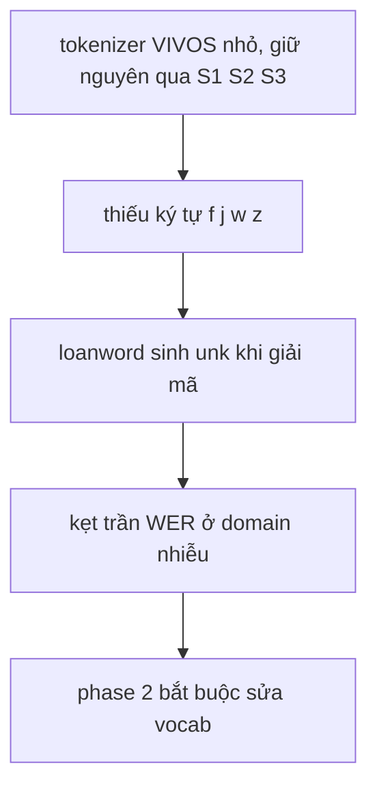

# 09.00 — Tổng quan nghiên cứu rebuild vocab phase 2

> **Vai trò:**
>
> Cổng vào cụm nghiên cứu về vấn đề tokenizer/vocab của ASR curriculum.
>
> Giữ bối cảnh + Glossary chung + liên kết; chi tiết nằm ở các bài con.

---

## Dẫn dắt bối cảnh

- Hình dung một học trò học viết:
  - được dạy bằng một **cuốn từ điển thiếu vài chữ cái** (thiếu f, j, w, z),
  - mọi từ chứa chữ đó (wifi, facebook, zalo) em đều viết sai, mãi không sửa được.
- Nghịch lý đã đo:
  - ý tưởng "bổ sung chữ thiếu vào từ điển" nghe rất hợp lý,
  - nhưng khi làm giữa chừng (nhánh s3rv), kết quả lại **XẤU HƠN** ở cả 9 test —
  - vì đổi từ điển đã **xoá trắng** phần não giải mã của model.

> Cụm tài liệu này bóc tách vì sao vocab là "issue tốn kém nhất", khảo sát các cách cập nhật từ điển mà KHÔNG xoá trắng model, và gói lại kinh nghiệm chi phí train để chốt hướng đi cho phase 2.

---

## Glossary chung

- `ASR` → **Automatic Speech Recognition** → nhận dạng tiếng nói thành chữ.
- `RNNT` → **RNN-Transducer** → kiến trúc ASR gồm 3 khối: encoder + decoder + joint.
- `encoder` → **encoder** → khối đọc audio ra đặc trưng âm học (KHÔNG phụ thuộc vocab).
- `decoder` → **prediction network** → khối "mô hình ngôn ngữ" đọc token trước đó (embedding phụ thuộc vocab).
- `joint` → **joint network** → khối gộp encoder + decoder, chiếu ra lớp đầu ra kích thước vocab (phụ thuộc vocab).
- `tokenizer` → **tokenizer** → bộ tách chữ thành token; ở đây SentencePiece BPE.
- `BPE` → **Byte-Pair Encoding** → thuật toán gộp cặp ký tự thành token con.
- `vocab` → **vocabulary** → tập token; kích thước **V** (ở đây 1024).
- `charset` → **character set** → tập ký tự gốc mà tokenizer phủ.
- `OOV` → **Out-Of-Vocabulary** → ký tự/từ ngoài vocab → sinh `<unk>`.
- `<unk>` → **unknown token** → token "không biết", làm sai cả từ.
- `change_vocabulary` → hàm NeMo đổi tokenizer — **dựng lại decoder+joint** (xem [01](01_incremental_vocab_methods.md)).
- `embedding` → **embedding** → bảng vector cho từng token (shape `[V, d]`).

---

## Vấn đề gốc — chuỗi nhân quả

**Khung đọc sơ đồ:**
- **Đề bài:** vì sao giữ tokenizer nhỏ lại tạo trần chất lượng.
- **Giả định:** tokenizer build trên VIVOS (đọc sạch, ít loanword), giữ qua mọi nấc.
- **Cách đọc (trên → dưới):**
  - tập lớn phía sau (viVoice YouTube, tin tức) chứa nhiều loanword có f/j/w/z,
  - tokenizer nhỏ không có token cho các ký tự này → `<unk>` → sai cả từ,
  - đo thật: 34% câu callbot chứa ký tự này → trần WER không thể phá bằng train thêm.

---

## Bản đồ cụm tài liệu

- [01_incremental_vocab_methods.md](01_incremental_vocab_methods.md)
  - câu hỏi: có cách nào cập nhật vocab/tokenizer mà KHÔNG reset decoder+joint?
  - khảo sát: vocab expansion, khởi tạo embedding token mới (FVT/WECHSEL/FOCUS), phẫu thuật tensor RNNT.
- [02_curriculum_and_cost_lessons.md](02_curriculum_and_cost_lessons.md)
  - đóng gói kinh nghiệm: thứ tự curriculum S1→S2→S3 + chi phí đo thật từng nấc + công thức ước lượng.

---

## Chốt hướng phase 2

- Ý tưởng sửa vocab là **đúng và bắt buộc** (không sửa thì kẹt trần).
- Cái sai của s3rv KHÔNG phải ý tưởng, mà là **cơ chế**: `change_vocabulary` reset decoder+joint → 3 epoch chưa hồi phục (đo: val 62% → 20% → 18%, vẫn đang giảm).
- Ba hướng đi (so sánh chi tiết ở [01](01_incremental_vocab_methods.md)):
  - rebuild vocab ngay từ **S1** (sạch nhất, nhưng train lại toàn curriculum ~48 GPU-h),
  - **continue-train** s3rv lâu hơn (rẻ, test nhanh giả thuyết undertrained),
  - **vocab expansion** — mở rộng từ điển giữ nguyên token cũ (tối ưu, cần code).
