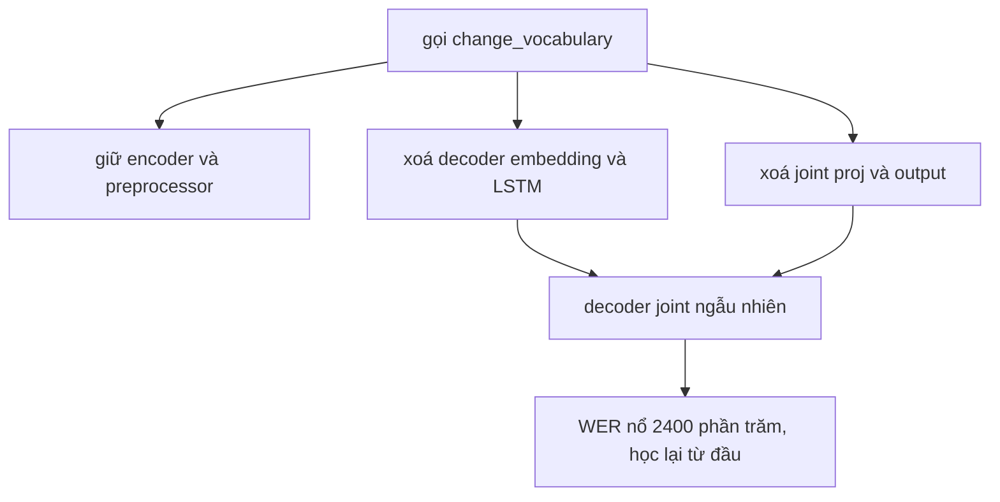
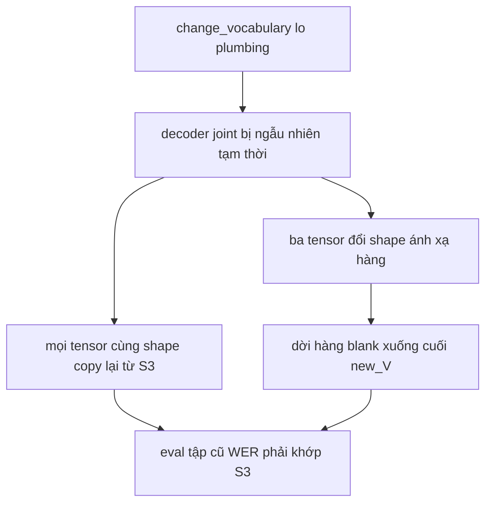

# 09.01 — Phương pháp mở rộng vocab đã kiểm chứng

> **Vai trò:**
>
> Ghi lại phương pháp incremental vocab expansion + tensor surgery đã triển khai và ĐO ĐƯỢC kết quả.
>
> Trả lời: thêm ký tự thiếu f/j/w/z mà giữ nguyên phần não đã train, thay vì xoá trắng như `change_vocabulary`.
>
> Kết quả thật + số liệu run: [../../experiments/08_vocab_expansion/02_result.md](../../experiments/08_vocab_expansion/02_result.md).

---

## Glossary

- **V** → **vocab size** → số piece của tokenizer (ở đây 1024); blank ở index cuối = V, tổng lớp đầu ra = V+1.
- **k** → **số token mới** thêm vào (ở đây 4: f/j/w/z).
- **d_pred** → **prediction hidden** → chiều embedding của decoder (đo thật: 640).
- **d_joint** → **joint hidden** → chiều ẩn của joint trước lớp đầu ra (đo thật: 640).
- `embed` → `decoder.prediction.embed.weight` → bảng embedding token, shape `[V+1, d_pred]`.
- `joint_out` → `joint.joint_net[-1]` → Linear cuối, `weight [V+1, d_joint]` + `bias [V+1]`.
- `blank` → **blank token** → token không phát chữ của RNNT, index = V, dịch chỗ khi V đổi.
- `FVT` → **Fast Vocabulary Transfer** → init token mới bằng trung bình embedding các mảnh con.
- `expansion` → **vocabulary expansion** → append token mới, giữ nguyên ID token cũ.
- `surgery` → **tensor surgery** → tự copy trọng số theo token vào tensor đã resize.
- `plumbing` → **plumbing** → phần lắp ráp cơ khí: resize module, sửa cfg, đổi tokenizer, dựng lại loss.
- `state_dict` → **state dict** → từ điển trọng số của model trong PyTorch.
- `strict load` → **strict load** → nạp state_dict yêu cầu khớp đủ mọi khoá, lệch là báo lỗi.

---

## Dẫn dắt bối cảnh

- Hình dung sửa một cuốn từ điển giấy đã dùng lâu:
  - ta chỉ cần dán thêm vài trang cho chữ mới f, j, w, z,
  - chứ không ai đốt cả cuốn rồi viết lại từ đầu.
- Công cụ mặc định của NeMo `change_vocabulary` lại làm đúng kiểu đốt cả cuốn:
  - đo thật ở nhánh s3rv: ngay sau đổi vocab, WER nổ ~2400 phần trăm,
  - dù chỉ định thêm 4 ký tự.
- Nghịch lý: chính công cụ gây hại đó lại chứa sẵn phần lắp ráp cơ khí ta cần.

> Tài liệu này ghi lại phương pháp đã chứng minh: mượn `change_vocabulary` để nó lo phần lắp ráp, rồi phẫu thuật khôi phục trọng số cũ, giữ nguyên phần não S3. Đã kiểm: sau phẫu thuật WER khớp S3 tuyệt đối, sau fine-tune model phát được ký tự trước đây bất khả.

---

## 1. Vì sao `change_vocabulary` là reset toàn phần

- ⚙️ **Cơ chế** (đọc source `rnnt_bpe_models.py`):
  - `del self.decoder` rồi dựng decoder mới từ config → mọi `Embedding`/`LSTM` về ngẫu nhiên,
  - `del self.joint` rồi dựng joint mới → mọi `Linear` về ngẫu nhiên,
  - `del self.loss` rồi dựng lại `RNNTLoss` cho khớp V mới.
- 🔍 **Nhận diện:**
  - không dòng nào đọc `old.state_dict()` hay copy theo token trùng → trọng số mới hoàn toàn,
  - kể cả tokenizer mới trùng phần lớn piece, decoder+joint vẫn học lại từ số 0.
- 💡 **Ý nghĩa:**
  - hàm thiết kế cho đổi sang ngôn ngữ hay domain khác, chấp nhận học lại decoder,
  - không dành cho vá vài ký tự → dùng sai mục đích chính là lỗi của s3rv.
- ⚠️ **Bẫy:**
  - phần bị vứt oan nhiều nhất là LSTM prediction và 2 lớp proj joint, vốn không phụ thuộc vocab.



**Khung đọc sơ đồ:**
- **Đề bài:** `change_vocabulary` giữ gì, xoá gì.
- **Giả định:** model RNNT ba khối encoder/decoder/joint; blank ở index cuối.
- **Cách đọc trên xuống dưới:** chỉ encoder sống; decoder+joint bị dựng lại ngẫu nhiên → mọi ánh xạ hidden sang token mất → WER về mức chưa train.

---

## 2. Đại lượng gốc — hai tensor phụ thuộc vocab đã mổ xác nhận

Mổ trực tiếp `s3-fc115m-full.nemo` cho thấy trong CẢ decoder lẫn joint, đúng **hai tensor và một bias** có kích thước gắn với V:

$$ \text{embed}: [\,V{+}1,\ d_{pred}\,] \qquad \text{joint\_out.weight}: [\,V{+}1,\ d_{joint}\,] \qquad \text{joint\_out.bias}: [\,V{+}1\,] $$

Giải nghĩa từ trái sang phải:
- **embed** = bảng embedding của decoder; số hàng V+1, mỗi token một hàng, hàng cuối cho blank.
- **d_pred** = chiều ẩn prediction network, không đổi khi V đổi.
- **joint_out.weight/bias** = lớp Linear cuối chiếu ra V+1 lớp xác suất token.
- **d_joint** = chiều ẩn joint, không đổi khi V đổi.

Số liệu thật đo được (model 114M, `EncDecRNNTBPEModel`, SentencePiece BPE):

- `decoder.prediction.embed.weight` shape `[1025, 640]`, padding_idx 1024,
- `joint.joint_net.2.weight` shape `[1025, 640]`, `joint.joint_net.2.bias` shape `[1025]`,
- V 1024, blank ở index 1024, unk ở index 0, không bos/eos/pad, `byte_fallback` tắt.

Mọi tensor còn lại độc lập vocab, giữ nguyên được:
- LSTM của prediction network là `weight_ih`, `weight_hh`, bias — chiếm phần lớn tham số decoder,
- hai lớp proj `joint.enc` và `joint.pred` chiếu encoder/decoder về d_joint.

> Kết quả mổ khớp lý thuyết: chỉ cần mọc thêm k hàng vào 2 tensor trên, giữ nguyên toàn bộ encoder và phần lớn decoder+joint. Đo cụ thể ở run: **702 tensor giữ nguyên, đúng 3 tensor phẫu thuật**.

---

## 3. Ba mảnh ghép của phương pháp đã kiểm chứng

### 3.1 Mở rộng tokenizer

- ⚙️ **Cơ chế:**
  - file `.model` của SentencePiece là protobuf `ModelProto` chứa list `pieces`,
  - append piece mới vào cuối, đặt `score` bằng `min_score` vocab gốc trừ 1 → ID token cũ bất biến, token mới nhận ID V, V+1, tiếp theo.
- 🔍 **Nhận diện:**
  - so `get_piece_size` trước và sau; encode một câu tiếng Việt cũ phải ra ID y hệt.
  - đo thật: câu "xin chào việt nam" giữ nguyên ID sau khi thêm f/j/w/z; "facebook" từ unk chuyển thành spell đúng.
- 💡 **Ý nghĩa:**
  - giữ ID cũ nghĩa là hàng embedding và output cũ tái dùng nguyên vẹn, chỉ thêm hàng mới.
- ⚠️ **Bẫy:**
  - append tay chỉ hợp ký tự đơn hoặc token nguyên khối; muốn tokenizer BPE tối ưu subword mới thì phải train lại BPE, mà train lại làm xáo ID nên mất lợi thế giữ trọng số,
  - với f/j/w/z là ký tự đơn thì append là đủ và đúng.

### 3.2 Khởi tạo hàng mới cho token mới

- ⚙️ **Cơ chế đã dùng:**
  - `embed[V:V+k]` init bằng trung bình toàn bộ embedding token cũ, đây là FVT rút gọn cho ký tự đơn,
  - `joint_out.weight[V:V+k]` init bằng 0,
  - `joint_out.bias[V:V+k]` init bằng `min(bias token cũ)` trừ 10.
- 🔍 **Nhận diện:**
  - k hàng output mới bị ép logit rất thấp → token mới gần như không bao giờ là argmax trước khi train.
- 💡 **Ý nghĩa:**
  - init này bảo toàn hành vi trước train: câu tiếng Việt giải mã y hệt S3 vì token mới bị dập, token cũ giữ nguyên,
  - khi fine-tune, gradient chảy vào k hàng đúng lúc nhãn có f/j/w/z nên chúng lớn dần → vẫn học được.
- ⚠️ **Bẫy:**
  - init phức tạp kiểu WECHSEL/ZeTT không cần cho k nhỏ; khảo sát cho thấy mean/FVT bám sát chúng chỉ sau vài checkpoint,
  - với joint output, dập bằng bias thấp an toàn hơn init mean vì đảm bảo cửa nghiệm thu trước train.

### 3.3 Phẫu thuật tensor bằng đường mượn plumbing

- ⚙️ **Cơ chế đã chứng minh** (khác bản kế hoạch cũ, sạch hơn):
  - gọi `change_vocabulary` để NeMo tự lo plumbing — resize 2 module theo V mới, sửa cfg vocab_size, đổi tokenizer, dựng lại `RNNTLoss` cho khớp,
  - chấp nhận `change_vocabulary` làm ngẫu nhiên trọng số, rồi khôi phục ngay: mọi tensor cùng shape copy lại từ S3, đúng 3 tensor đổi shape thì ánh xạ hàng,
  - `load_state_dict` với strict để bắt mọi lệch khoá.
- 🔍 **Nhận diện tiêu chí nghiệm thu:**
  - eval ngay sau phẫu thuật trên tập cũ không có f/j/w/z → WER phải khớp WER S3,
  - nếu WER nổ thì copy sai hàng hoặc sai vị trí blank, sửa trước khi train.
- 💡 **Ý nghĩa:**
  - đường mượn plumbing tránh việc tự resize module và tự sửa cfg/loss vốn dễ sai,
  - encoder và phần lớn decoder/joint giữ đúng từng bit nên chỉ k hàng cần học, không có cú sốc 2400 phần trăm.
- ⚠️ **Bẫy chí tử về vị trí blank:**
  - NeMo đặt blank ở index cuối là V; thêm token làm V thành V+k nên blank dời từ hàng V xuống hàng V+k,
  - phải copy hàng blank cũ `old[V]` sang hàng mới `new[V+k]` cho cả 3 tensor; quên là hỏng alignment RNNT vì blank điều khiển độ dài output.

Ánh xạ hàng cho cả 3 tensor, dim 0 là trục vocab cộng blank:

```python
# old_V = 1024, new_V = 1028, k = 4; new tensor có new_V+1 = 1029 hàng
t[0:old_V]        = old_t[0:old_V]              # token cũ, giữ nguyên
t[old_V:old_V+k]  = init                        # token mới: embed=mean, weight=0, bias=min-10
t[new_V]          = old_t[old_V]                # blank cũ (hàng old_V) dời xuống hàng new_V
```



**Khung đọc sơ đồ:**
- **Đề bài:** phẫu thuật chạm vào đâu, kiểm ra sao.
- **Giả định:** vocab mới là superset vocab cũ, chỉ append; các chiều ẩn không đổi.
- **Cách đọc:** để `change_vocabulary` dựng khung đúng size, rồi ghi đè trọng số cũ vào; 3 tensor mọc thêm k hàng; dời blank; verify bằng WER tập cũ trước khi train.

---

## 4. Kết quả đã đo — hai cửa nghiệm thu

### 4.1 Cửa 1 — phẫu thuật bảo toàn hành vi

- ⚙️ **Cơ chế:** eval `s3-vocabexp.nemo` ngay sau phẫu thuật, chưa train, trên suite 10 test.
- 🔍 **Nhận diện:** WER khớp S3 tới hàng phần trăm thứ hai trên cả 10 test.

| Test | S3 | s3-vocabexp |
| --- | --- | --- |
| vivos | 8,47 | 8,47 |
| vss in-scope | 17,68 | 17,68 |
| fleurs | 16,46 | 16,45 |
| vlsp | 24,81 | 24,81 |
| bud500 | 6,73 | 6,73 |

- 💡 **Ý nghĩa:** chứng minh cập nhật vocab không cần re-train; token cũ và blank không hề bị đụng.
- ⚠️ **Bẫy:** chênh cỡ 0,01 điểm là nhiễu làm tròn transcribe, không phải lệch trọng số. Bảng đủ 10 test ở [02_result.md](../../experiments/08_vocab_expansion/02_result.md).

### 4.2 Cửa 2 — fine-tune kích hoạt token mới

- ⚙️ **Cơ chế:** fine-tune nhẹ trên data chứa loanword để dạy decoder+joint phát token mới.
- 🔍 **Nhận diện:** đếm số từ f/j/w/z ra đúng chính tả trên test callbot.
  - S3: 0 trên 932 lần xuất hiện đúng,
  - sau fine-tune vòng 1: 99 trên 932 đúng; model phát được ký tự trước bất khả, whisky ra "wisky", fpt ra "fp".
- 💡 **Ý nghĩa:** cơ chế chạy end-to-end — thứ trước đây không thể sinh giờ sinh được.
- ⚠️ **Bẫy đã gặp ở vòng 1:**
  - mix gọn cap mạnh nhóm đọc làm decoder trôi giọng, fosd xấu +1,38 điểm,
  - freeze encoder cộng 2 epoch chưa đủ nên còn false positive 3,3 phần trăm và 833 từ còn sai,
  - kết luận vòng 1: net-neutral, S3 vẫn là model production; vòng 2 sửa bằng full replay cộng mở encoder cộng lr nhỏ cộng train lâu hơn.

---

## 5. So ba hướng đi phase 2

- **A. Rebuild ở S1:**
  - cơ chế: tokenizer đủ charset từ đầu, train lại cả curriculum,
  - chi phí: khoảng 48 GPU-h, đắt nhất,
  - rủi ro: thấp, sạch nhất,
  - chọn khi: làm lại bài bản, có thời gian.
- **B. Continue-train s3rv:**
  - cơ chế: train tiếp s3rv đã reset thêm vài epoch,
  - chi phí: khoảng 20-30 GPU-h,
  - rủi ro: trung bình, đã mất trọng số decoder cũ,
  - chọn khi: chỉ để kiểm nhanh giả thuyết undertrained.
- **C. Expansion cộng surgery, đã kiểm chứng:**
  - cơ chế: append f/j/w/z, mượn plumbing, vá 3 tensor, giữ nguyên S3,
  - chi phí: thấp nhất, chỉ fine-tune nhẹ,
  - rủi ro: cần code đúng vị trí blank, đã có `surgery.py` chạy được,
  - chọn khi: muốn rẻ và giữ tài sản S3.

- Hướng **C** là kết luận của cả khảo sát literature lẫn đọc source, và giờ có bằng chứng thực đo: cửa 1 khớp S3 tuyệt đối, cửa 2 kích hoạt được token mới.
- Hướng **B** chỉ để kiểm chứng nhanh undertrained; val s3rv 62 rồi 20 rồi 18 vẫn đang giảm.
- Hướng **A** là bản sạch dài hạn nếu muốn tokenizer BPE tối ưu subword tiếng Việt, không chỉ vá ký tự.

---

## 6. Công thức áp dụng

- **Bước 0 đã kiểm:** f/j/w/z không có trong vocab S3, đo 0 token, nên cần expansion thật chứ không chỉ fine-tune.
- **Trình tự rẻ rồi chắc theo hướng C:**
  1. append k piece ký tự vào `ModelProto`, `score` bằng `min_score` vocab gốc trừ 1, giữ ID cũ,
  2. init hàng mới: `embed` bằng mean token cũ, `joint_out.weight` bằng 0, `joint_out.bias` bằng min trừ 10,
  3. gọi `change_vocabulary` lo plumbing, rồi khôi phục mọi tensor cùng shape và ánh xạ 3 tensor, dời blank xuống cuối,
  4. nghiệm thu tức thì: WER tập cũ khớp S3, nếu nổ thì sửa copy hoặc blank,
  5. fine-tune trên data chứa loanword với full replay nhóm đọc, lr nhỏ; đo cả tập cũ không tụt lẫn tập loanword phải tăng.
- **Cảnh báo trung thực:**
  - số epoch để token mới học đủ và hết false positive PHẢI đo thật, vòng 1 mới đạt 99 trên 932,
  - tiêu chí nghiệm thu quan trọng nhất vẫn là WER sau phẫu thuật khớp trước phẫu thuật.

---

## ✅ Tự kiểm nhanh

1. `change_vocabulary` giữ khối nào, xoá khối nào của RNNT?
2. Đúng bao nhiêu tensor thật sự phụ thuộc V, tên là gì?
3. Vì sao phương pháp đã kiểm chứng vẫn GỌI `change_vocabulary`?
4. Bẫy chí tử khi mở rộng vocab của RNNT là gì?
5. Tiêu chí nghiệm thu tức thì sau phẫu thuật, trước khi train, là gì?

<details><summary>Đáp án</summary>

1. Giữ encoder và preprocessor; xoá rồi dựng lại ngẫu nhiên decoder gồm embedding và LSTM, joint gồm proj và output, cùng loss.
2. Đúng 2 cộng 1 bias: `decoder.prediction.embed.weight [V+1, d_pred]` và `joint.joint_net[-1].weight [V+1, d_joint]` cộng `.bias [V+1]`. LSTM và 2 proj joint độc lập V.
3. Vì `change_vocabulary` lo đúng phần plumbing khó tự làm là resize module, sửa cfg, đổi tokenizer, dựng lại loss; ta chỉ ghi đè lại trọng số cũ sau đó nên tránh tự resize dễ sai.
4. Blank ở index cuối là V; khi V thành V+k, blank dời xuống V+k; quên copy hàng blank là hỏng alignment.
5. Eval tập cũ không có f/j/w/z ngay sau phẫu thuật; WER phải khớp WER S3, nếu nổ là copy sai hàng hoặc sai blank.

</details>
