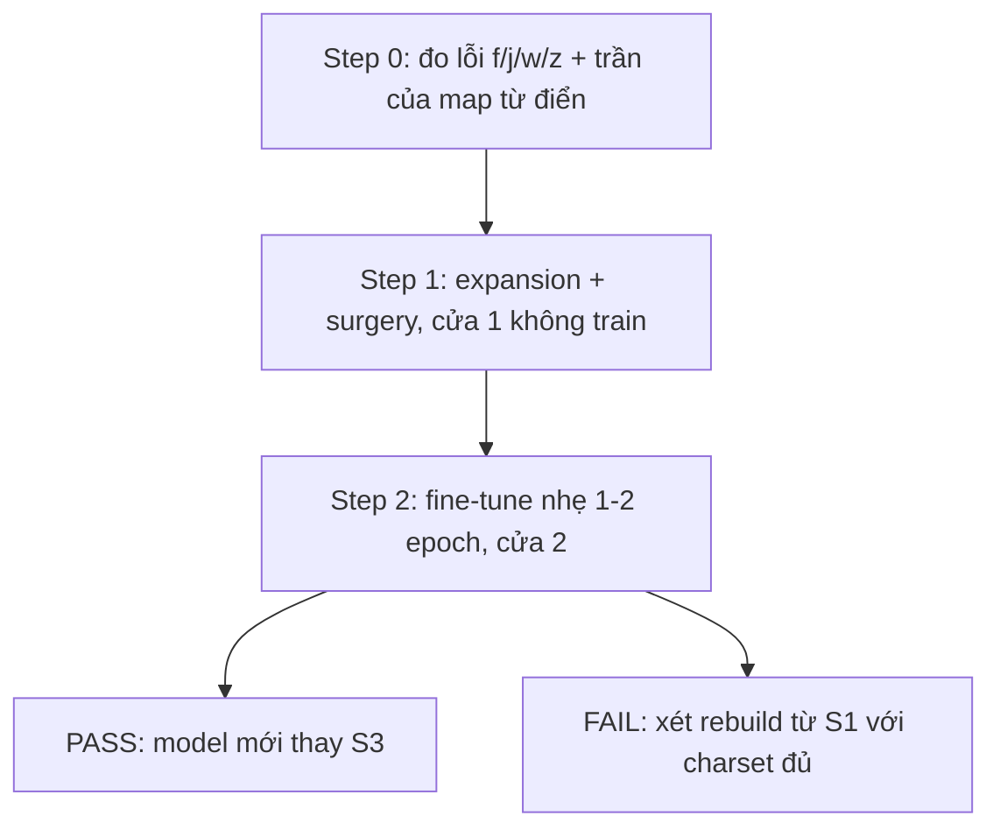

# 08 — Vocab expansion phase 2: gỡ trần f/j/w/z

> **Vai trò:**
>
> Folder task **open-end** cho phase 2 sửa vocab — đi từng step, kết quả step trước quyết định step sau.
>
> Nền tảng lý thuyết + bảng giải pháp: [../../docs/09_vocab_rebuild_research/](../../docs/09_vocab_rebuild_research/00_overview.md) và thread paper-repo `fci_paper_research/06_train_optim/03_vocab_adaptation`.

---

## 1. Đề bài + ràng buộc

- **Bài toán:**
  - model S3 (tốt nhất, callbot 22,87%) bị trần loanword vì tokenizer 1024 thiếu ký tự f/j/w/z,
  - cần gỡ trần với chi phí vừa phải, KHÔNG phá 9 test hiện có.
- **Ràng buộc cứng:**
  - không thoái lui 9 test của S3 (lệch cho phép < ~1 điểm tuyệt đối),
  - 1× GPU GB10 dùng chung — ngân sách hướng chính ≤ ~11 GPU-h,
  - s3rv (change_vocabulary, reset toàn phần) đã thử và LOẠI — 12,7 GPU-h, 9/9 test xấu hơn.
- **Số nền đã đo (2026-07-05):**
  - vietsuperspeech.test: 1000 câu, **341 câu (34,1%)** chứa f/j/w/z, 3,63h audio,
  - fleurs_vi.test: 844 câu, **113 câu (13,4%)**,
  - common_voice_vi.test: 1225 câu, chỉ 3 câu (0,2%) — trần f/j/w/z KHÔNG nằm ở cv.

---

## 2. Step ladder

**Khung đọc:** mỗi step có tiêu chí PASS riêng; fail ở cửa nào thì dừng xử lý ở cửa đó, không đổ thêm GPU.

- **Step 0 — đo hiện trạng (GPU chỉ để infer, ~0 chi phí train):**
  - transcribe S3 trên vietsuperspeech.test + fleurs_vi.test, dump hypothesis từng câu,
  - trả lời 3 câu hỏi:
    - WER subset câu chứa f/j/w/z cao hơn phần còn lại bao nhiêu — trần do vocab lớn cỡ nào,
    - lỗi rơi đúng vào TỪ chứa f/j/w/z chiếm bao nhiêu % tổng lỗi,
    - model phiên âm các từ đó thành gì — biến thể có ổn định đủ để map từ điển (giải pháp A) không,
  - PASS = có bảng số + kết luận A đáng làm hay không + danh sách từ đích cho expansion.
- **Step 0.5 — data audit + chốt phạm vi (sinh ra từ kết quả step 0):**
  - phát hiện: 15% câu test + 12,5% dòng train vietsuperspeech là english-heavy nhãn nhiễu — chiếm 27,5% tổng lỗi test,
  - việc: đo kỹ nhóm này trong train, phương án lọc; Kỳ chốt phạm vi callbot (chỉ Việt + loanword, hay phải nhận cả tiếng Anh),
  - PASS = có quyết định phạm vi + danh sách lọc train trước khi fine-tune cửa 2.
- **Step 1 — expansion + FVT + tensor surgery (cửa 1, 0 GPU-h train):**
  - append token mới (charset f/j/w/z + subword loanword từ danh sách step 0) GIỮ ID cũ,
  - chỉ mở rộng 2 tensor `embed` + `joint_out` (init mean/FVT), không đụng phần còn lại,
  - PASS = eval 9 test ngay sau phẫu thuật, WER ≈ S3 (lệch < 1 điểm). FAIL = debug surgery (nghi blank-shift), không train.
- **Step 2 — fine-tune nhẹ (cửa 2, ~5-11 GPU-h):**
  - 1-2 epoch mix S3 (h/epoch đo thật ≈ 5,25h),
  - PASS = callbot giảm trên subset f/j/w/z VÀ 9 test không thoái lui.
- **Điều kiện đổi hướng:**
  - cửa 2 fail sau 2 epoch (subset f/j/w/z không nhúc nhích) → xét rebuild từ S1 với charset chốt đủ (~48 GPU-h).

---

## 3. File trong folder

- `step0_transcribe.py` — dump hypothesis từng câu (chạy DGX, venv repo, GPU).
- `step0_analyze.py` — phân tích lỗi f/j/w/z từ file hyp (CPU, chạy lại thoải mái).
- Kết quả từng step thêm dần: `step0_report.md`, ...

---

## 4. Journal — điền dần theo step

| Ngày | Step | Kết quả | Quyết định tiếp |
| --- | --- | --- | --- |
| 2026-07-05 | mở task | chốt combo A + C theo bảng cost vs hiệu quả | chạy step 0 |
| 2026-07-05 | step 0 | XONG — [step0_report.md](step0_report.md): lỗi tại từ f/j/w/z chỉ 9,2% tổng lỗi; A yếu (≤ −0,3 điểm, hạ ưu tiên); phát hiện nhóm english-heavy nhãn nhiễu chiếm 27,5% lỗi test + 12,5% train | sinh step 0.5 (data audit + Kỳ chốt phạm vi tiếng Anh) trước cửa 1 |
| 2026-07-05 | chốt phạm vi | Kỳ chốt: chỉ Việt + từ Anh ngắn (tên sản phẩm/tên riêng), KHÔNG mix tiếng Anh dài. Thước in-scope = 17,8% (848 câu); trần C: 16,9% (trực tiếp) → ~14,3% (hết lan toả); bằng chứng "acebook/opline/irst" — âm học đã sẵn, chỉ thiếu ký hiệu | step 0.5: lọc english-heavy khỏi train + dựng manifest thước in-scope + xem tay của/whisky |
| 2026-07-05 | step 0.5 | XONG — train.clean giữ 54.025 lọc 5.631 (9,4%, xem tay đều rác thật, bản gốc không đụng); viVoice không lọc (0,05%, có ca oan); test.inscope 842 câu — **thước chính thức S3 = 17,68%** | cửa 1: code expansion + surgery (danh sách token từ bảng từ đích in-scope) |
| 2026-07-05 | cửa 1 | XONG PASS — surgery s3-vocabexp.nemo (thêm f/j/w/z, 702 tensor copy nguyên, 3 tensor V ánh xạ, strict OK); eval CHƯA train khớp S3 chính xác: vivos 8,47% / vss-inscope 17,68% / fleurs 16,45% (y hệt S3) | cửa 2: fine-tune |
| 2026-07-05 22:33 | cửa 2 | LAUNCH — s4-vocabexp-ft, freeze encoder, mix gọn ~124k dòng, 2 epoch, max 480 phút (chia GPU YOLO hieutb). Smoke PASS trước đó | chờ sáng: eval-after + report |
| 2026-07-06 01:50 | cửa 2 XONG | 2 epoch đầy đủ (3,67h). **Cơ chế THẮNG: f/j/w/z 0→99 từ đúng**; nhưng net-neutral (vss in-scope −0,25; fosd +1,38 vượt ngưỡng) do cap replay nhóm đọc + train ngắn (false positive 3,3%). Chi tiết [02_result.md](02_result.md) | S3 vẫn production; vòng sau: FULL replay + train lâu + mở encoder lr nhỏ |
| 2026-07-06 07:07 | vòng 2 LAUNCH | `s5-vocabexp-full` (config `configs/s5_vocabexp_full.yaml`) — sửa cả 2 lỗi vòng 1: FULL replay nhóm đọc (không cap fosd/vlsp/lsvsc) + mở encoder + lr 5e-5 + 3 epoch. Init s3-vocabexp. Kỳ chốt ưu tiên ASR cao nhất, chia GPU bình thường | chờ ~28h: eval-after 10 test + phân tích f/j/w/z + report |
