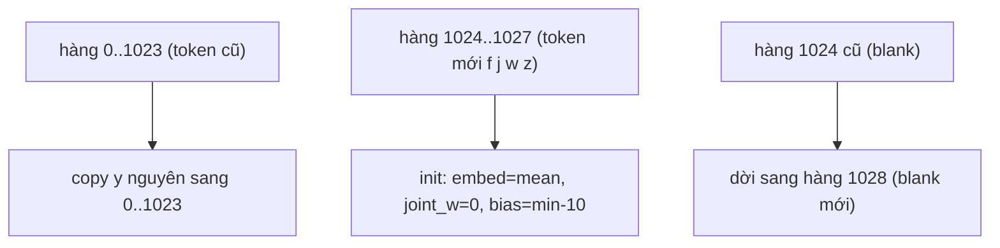
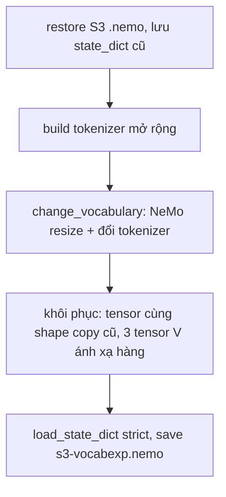

# 08.01 — Thiết kế phẫu thuật vocab expansion (design doc)

> **Vai trò:**
>
> Doc kỹ thuật đầy đủ cho cửa 1 + cửa 2 của task 08.
>
> Ghi rõ toán học phẫu thuật tensor, cách mở rộng tokenizer, tiêu chí nghiệm thu, recipe fine-tune, rủi ro.
>
> Nền lý thuyết model-agnostic: `fci_paper_research/06_train_optim/03_vocab_adaptation`; áp dụng RNN-T cụ thể: [../../docs/09_vocab_rebuild_research/](../../docs/09_vocab_rebuild_research/00_overview.md).

---

## Glossary

- `V` → **vocab size** → số token thật của tokenizer (cũ 1024, mới 1028).
- `blank` → **RNN-T blank** → nhãn rỗng của transducer, index = V (cuối cùng của lớp output V+1).
- `embed` → **prediction embedding** → bảng vector đầu vào của prediction network, shape `[V+1, pred_hidden]`.
- `joint_out` → **joint output layer** → Linear cuối của joint, chiếu ra `[V+1, joint_hidden]` + bias `[V+1]`.
- `FVT` → **Fast Vocabulary Transfer** → init token mới bằng trung bình các mảnh con; ở đây token mới là 1 ký tự nên dùng mean toàn cục.
- `surgery` → **tensor surgery** → copy trọng số cũ vào vị trí mới theo ánh xạ hàng, không dựng lại module.
- `change_vocabulary` → hàm NeMo đổi tokenizer, dựng lại decoder+joint NGẪU NHIÊN (đường s3rv đã chết).

---

## 1. Dẫn dắt bối cảnh

- Model S3 nghe đúng âm loanword nhưng viết sai vì tokenizer 1024 thiếu ký tự f/j/w/z (đo ở [step0_report.md](step0_report.md): facebook nghe ra "acebook", whisky ra "isky").
- Nghịch lý đã gặp: cách "chính thống" để thêm ký tự (`change_vocabulary`) lại xoá trắng phần giải mã → s3rv WER nổ 2400%.
- Doc này mô tả đường đi vòng: dùng `change_vocabulary` CHỈ để NeMo lo phần cấu hình/tokenizer, rồi **phẫu thuật khôi phục toàn bộ trọng số cũ** — chỉ 3 tensor phụ thuộc V được ánh xạ lại, phần còn lại bê nguyên.

---

## 2. Số liệu mổ model thật (đã đo)

- Model: `EncDecRNNTBPEModel`, tokenizer `SentencePieceTokenizer` (BPE, unk_id=0, không bos/eos/pad, byte_fallback=False).
- `V = 1024`, blank ở index 1024, lớp output = 1025.
- **Đúng 3 tensor phụ thuộc V** (mọi tensor khác độc lập vocab):
  - `decoder.prediction.embed.weight` shape `[1025, 640]`, padding_idx=1024,
  - `joint.joint_net.2.weight` shape `[1025, 640]`,
  - `joint.joint_net.2.bias` shape `[1025]`.
- Dry-run append f/j/w/z (đã chạy): token cũ giữ NGUYÊN ID (câu Việt "xin chào việt nam" ids không đổi), token mới vào 1024-1027, blank dời lên 1028; round-trip encode/decode chuẩn (facebook, wifi, zalo, fpt, whisky đều đúng).

---

## 3. Toán học phẫu thuật

Sau khi mở rộng tokenizer thêm `k` token (k=4: f,j,w,z), lớp output tăng từ `V+1=1025` lên `V'+1=1029` với `V'=1028`.

Ánh xạ hàng cho CẢ 3 tensor (gọi hàng cũ `o[.]`, hàng mới `n[.]`):

**Khung đọc:** ba nhóm hàng, mỗi nhóm một luật; token cũ và blank giữ trọng số S3, chỉ 4 hàng mới là khởi tạo.

- **embed** `[1029, 640]`:
  - `n[0:1024] = o[0:1024]` (token cũ),
  - `n[1024:1028] = mean(o[0:1024], dim=0)` (đầu vào cho token mới khi được sinh và nạp ngược),
  - `n[1028] = o[1024]` (blank dời).
- **joint_out.weight** `[1029, 640]`:
  - `n[0:1024] = o[0:1024]`,
  - `n[1024:1028] = 0` (KHÔNG cho model bật token mới TRƯỚC khi train → cửa 1 giữ hành vi S3),
  - `n[1028] = o[1024]`.
- **joint_out.bias** `[1029]`:
  - `n[0:1024] = o[0:1024]`,
  - `n[1024:1028] = min(o[0:1024]) - 10` (đè cứng, token mới không thể là argmax lúc chưa train),
  - `n[1028] = o[1024]`.

Vì sao init joint = 0 và bias thấp: đảm bảo **cửa 1 (chưa train) WER ≈ S3** cho 9 test — token mới bị ép không xuất hiện, câu tiếng Việt (ids không đổi) giải mã y hệt. Khi fine-tune, gradient chảy vào 4 hàng này đúng lúc nhãn có f/j/w/z → chúng lớn dần. Đây là init an toàn nhất cho cửa 1, vẫn train được.

---

## 4. Quy trình code

- Bước m3 làm NeMo lo plumbing (cập nhật `model.cfg`, resize module, gắn tokenizer mới) — nhưng dựng lại decoder+joint NGẪU NHIÊN.
- Bước m4 vô hiệu hoá cái ngẫu nhiên đó: MỌI tensor cùng shape (encoder, LSTM prediction, joint pre-projection) copy lại từ S3; đúng 3 tensor đổi shape thì ánh xạ hàng ở §3.
- Kết quả: model = S3 y hệt, chỉ thêm 4 hàng token mới (bị ép im) + tokenizer mở rộng.

---

## 5. Nghiệm thu 2 cửa

- **Cửa 1 (0 GPU-h train) — verify phẫu thuật đúng:**
  - encode round-trip 4 token mới đúng + câu Việt ids không đổi,
  - eval 9 test NGAY sau surgery, WER lệch S3 < ~1 điểm tuyệt đối,
  - FAIL → nghi ánh xạ hàng (nhất là dời blank) → debug, KHÔNG train.
- **Cửa 2 (fine-tune) — verify học được token mới:**
  - PASS = WER subset f/j/w/z trên callbot giảm rõ VÀ 9 test không thoái lui > 1 điểm,
  - thước chính: `vietsuperspeech.test.inscope` (842 câu, S3 = 17,68%); kỳ vọng 16,9% (trực tiếp) → ~14,3% (hết lan toả).

---

## 6. Recipe fine-tune cửa 2

- **init_from:** `s3-vocabexp.nemo` (đã surgery), `change_vocabulary=false` (tokenizer đã nằm trong .nemo).
- **freeze_encoder=true:** encoder đã nghe đúng âm; chỉ cần dạy decoder+joint phát token mới → rẻ hơn, an toàn hơn (âm học không đổi → 9 test khó thoái lui), đúng trọng tâm bài toán vocab.
- **Data — mix GỌN nhắm f/j/w/z (không phải full curriculum):**
  - lý do: encoder đóng băng nên chỉ dạy decoder+joint phát token mới; bud500-full (0% f/j/w/z) + audiobook chỉ tốn compute mà không dạy gì,
  - giữ `vietsuperspeech_clean` (gold f/j/w/z 27%) + viVoice cap 15k + replay 7 domain (vivos/cv/fleurs/lsvsc/vlsp/fosd/bud500 cap nhỏ) giữ 9 test,
  - ~124k dòng/epoch (so 612k full) → vừa 1 đêm khi chia GPU với YOLO của hieutb (~0,27 it/s → ~4h/epoch).
- **epochs=2, lr=1e-4 cosine, eff batch 256, bf16, max_minutes=480** (trần 8h, dừng kịp sáng + vẫn eval+save khi chạm trần).
- **checkpoint:** top-3 theo val_wer, mỗi 500 step; `val_check_interval=0.5` (2 lần/epoch) để có ckpt trung gian eval sáng mai nếu chưa đủ 2 epoch.
- eval_fixed thêm `vietsuperspeech_inscope` để results.json có cả số full-test lẫn in-scope, before và after.

---

## 7. Rủi ro + phòng ngừa

- **Ánh xạ blank sai** (bẫy lớn nhất) → phẫu thuật xong eval câu Việt phải ≈ S3; nếu WER nổ khắp nơi là blank lệch → dừng ở cửa 1, 0 GPU-h mất.
- **Chia GPU với YOLO** → chậm; đặt max_minutes trần, checkpoint dày → luôn có kết quả từng phần.
- **4 char quá tối giản** → nếu cửa 2 cải thiện ít, thêm loanword nguyên từ (fpt, wifi...) làm token atomic ở vòng sau; chưa làm vội để test cơ chế cho sạch.
- **freeze encoder giới hạn lan toả** → nếu muốn thêm, vòng sau mở encoder lr nhỏ; run 1 ưu tiên an toàn 9 test.
- **KHÔNG đụng data gốc:** mọi manifest mới là file riêng (`*_clean`, `*.inscope`); bản gốc nguyên vẹn.
