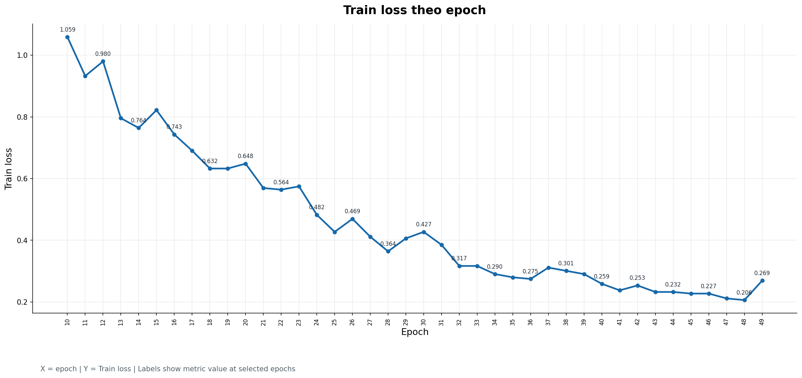
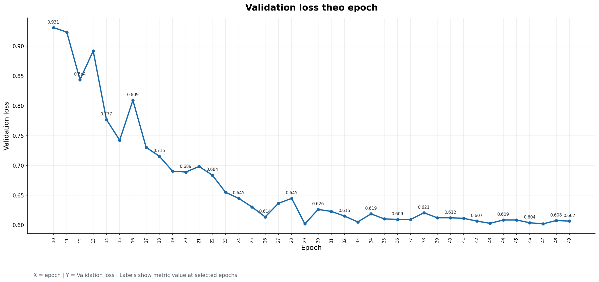
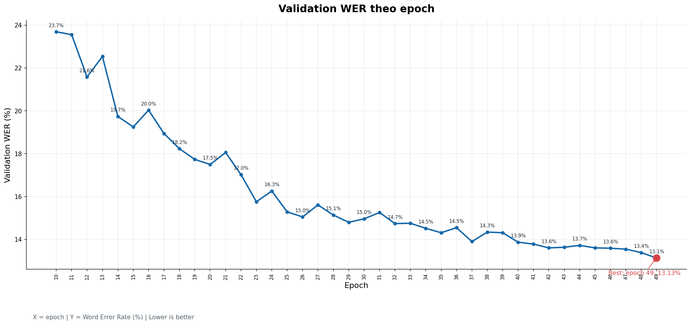
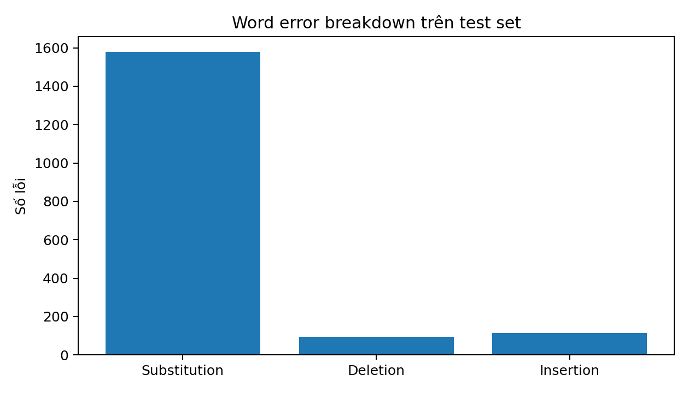
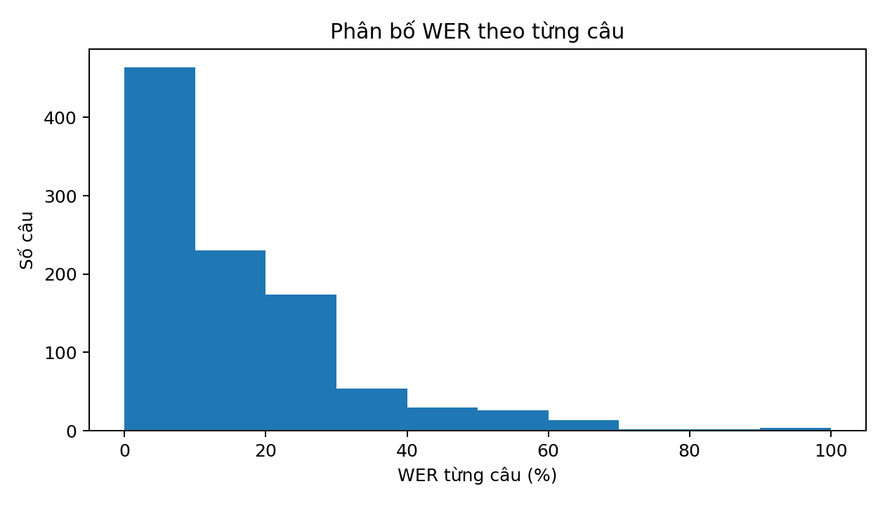

# Báo cáo - FastConformer CTC fine-tune trên VIVOS

Nguồn gốc: `D:\Downloads\final_report_updated_error_analysis.docx`.

Run liên quan: `vivos-fc-ctc-v2norm`.

Experiment ledger: `../experiments/01_fastconformer_ctc_v2norm_kaggle/RESULT.md`.

Insight: `../insight/error_analysis/01_fastconformer_ctc_v2norm.md`.

## 1. Tóm tắt chính

| Thông tin | Giá trị |
| --- | --- |
| Model pretrained | `nvidia/stt_en_fastconformer_ctc_large` |
| Model type | `EncDecCTCModelBPE` |
| Dataset | VIVOS tiếng Việt |
| Decoder | CTC |
| Metric chính | WER |
| WER trước fine-tune | 100.43% |
| WER sau fine-tune/test | **14.13%** |
| Best validation WER | **13.10%** tại epoch 49 |
| Corpus CER sau fine-tune | **7.67%** |
| Relative WER reduction | **85.93%** |
| Số câu test trong error analysis | 1000 câu |
| Tổng lỗi word | S=1579, D=94, I=115 |
| Thời gian transcribe test set | 31.1 giây |

Nhận xét nhanh: WER giảm từ **100.43%** xuống **14.13%**, chứng minh FastConformer CTC đã thích nghi tốt với VIVOS sau fine-tune. WER trước fine-tune lớn hơn 100% là hợp lý vì model gốc là tiếng Anh, số lỗi chèn/xóa/thay thế có thể vượt số từ reference.

## 2. Mục tiêu thí nghiệm

Mục tiêu là fine-tune FastConformer CTC pretrained trên dữ liệu tiếng Việt VIVOS, sau đó đánh giá mức cải thiện trước và sau fine-tune. Báo cáo theo dõi WER, CER, validation WER, RTF, artifact và phân tích lỗi trên test set.

## 3. Dataset và tiền xử lý

- Ngôn ngữ: tiếng Việt.
- Dữ liệu: audio + transcript VIVOS.
- Pipeline dùng manifest cho train/validation/test.
- Transcript cần được chuẩn hóa nhất quán giữa train, validation và test: khoảng trắng, chữ hoa/thường, dấu câu và ký tự đặc biệt.

Caveat: report hiện chưa xuất trực tiếp số utterance, tổng giờ audio, sampling rate và số speaker theo từng split. Đây là việc cần bổ sung cho bản báo cáo hoàn chỉnh hơn.

## 4. Cấu hình run

| Thông tin | Giá trị |
| --- | --- |
| pretrained | `nvidia/stt_en_fastconformer_ctc_large` |
| epochs | 50 |
| batch size | 16 |
| learning rate | 0.0002 |
| vocab_size | 1024 |
| cuda | true |
| completed epochs | 50 |
| latest epoch logged | 49 |
| latest/global step | 34,751 |
| median steps/epoch | khoảng 695 |
| train time | 18,375.5 giây, khoảng 5.10 giờ |

Checkpoint cuối:

```text
/kaggle/working/runs/vivos-fc-ctc-v2norm/checkpoints/epoch-end-epoch049-step034751.ckpt
```

File `.nemo`:

```text
/kaggle/working/runs/vivos-fc-ctc-v2norm/report/../fastconformer_vivos_ft.nemo
```

## 5. Evaluation protocol

Metric chính là WER:

```text
WER = (S + D + I) / N
```

Trong đó:

- S: số từ bị thay thế sai.
- D: số từ bị xóa/mất trong prediction.
- I: số từ bị chèn thêm trong prediction.
- N: tổng số từ trong transcript gốc.

RTF được dùng để đánh giá tốc độ inference. RTF < 1 nghĩa là hệ thống chạy nhanh hơn thời gian thực.

## 6. Kết quả định lượng

| Metric | Trước fine-tune | Sau fine-tune | Nhận xét |
| --- | ---: | ---: | --- |
| WER | 100.43% | **14.13%** | Giảm 86.30 điểm phần trăm |
| Relative WER reduction | - | **85.93%** | Cải thiện mạnh sau fine-tune |
| Best validation WER | - | **13.10%** | Đạt tại epoch 49 |
| Validation WER cuối log | - | **13.10%** | Gần như trùng best WER |
| RTF | 0.003 | **0.054** | Chậm hơn trước fine-tune nhưng vẫn < 1 |
| Corpus CER | - | **7.67%** | Lỗi ký tự thấp hơn WER |

### Biểu đồ train/validation



Hình 1. Train loss theo epoch.



Hình 2. Validation loss theo epoch.



Hình 3. Validation WER theo epoch.

Validation loss không tăng mạnh ở cuối quá trình train; best validation WER và validation WER cuối đều ở 13.10%, nên report chưa cho thấy overfit mạnh. Test WER 14.13% cao hơn nhẹ so với validation WER, mức chênh này chấp nhận được nhưng vẫn nên kiểm tra thêm trên dữ liệu độc lập hơn.

## 7. Artifact và tài nguyên

| Artifact | Kích thước |
| --- | ---: |
| `fastconformer_vivos_ft.nemo` | 463.13 MB |
| `epoch-end-epoch049-step034751.ckpt` | 1,388.41 MB |
| `step-034500-epoch049-step034500.ckpt` | 1,388.41 MB |
| `logs/version_0/metrics.csv` | 0.09 MB |
| `run.log` | 0.34 MB |

| Tài nguyên | Giá trị |
| --- | --- |
| CPU logical/physical | 4 / 2 |
| RAM total/available | 31.348 GB / 30.073 GB |
| GPU | Tesla T4 x2, mỗi GPU khoảng 15,360 MB VRAM |

## 8. Error analysis trên test set

Error analysis chạy trên 1000 câu từ `test.jsonl`, dùng artifact `fastconformer_vivos_ft.nemo`.

| Metric | Value |
| --- | ---: |
| Corpus WER | 14.13% |
| Corpus CER | 7.67% |
| Substitution | 1,579 |
| Deletion | 94 |
| Insertion | 115 |
| Tổng lỗi word | 1,788 |
| Tỉ lệ substitution | 88.3% |

### Biểu đồ phân tích lỗi



Hình 4. Phân rã lỗi word: substitution là nguồn lỗi lớn nhất, vượt xa deletion và insertion.



Hình 5. Phân bố WER theo từng câu trên test set.

Substitution là nguồn lỗi chính. Điều này gợi ý bước tiếp theo nên tập trung vào giảm nhầm lẫn giữa các từ/âm gần nhau, thay vì chỉ xử lý output rỗng hay lỗi mất từ.

## 9. Mẫu lỗi tiêu biểu

| Nhóm lỗi | Ví dụ |
| --- | --- |
| Substitution | `việt -> việc`, `chị -> chỉ`, `đều -> điều`, `xin -> sinh`, `dạy -> dậy` |
| Deletion | `làm`, `những`, `sự`, `phải`, `học` |
| Insertion | `t`, `l`, `c`, `d`, `tr`, `ph` |

Một số câu WER cao cần nghe lại:

| idx | WER | Reference | Prediction |
| ---: | ---: | --- | --- |
| 825 | 100.0% | `tự dưng trong lòng tôi nảy nở một hình ảnh rất đẹp` | `giá nói` |
| 547 | 100.0% | `khi tôi ăn cơm con đừng ăn mãi một món ưng ý nhé` | `khi tôi ăn cơm ăn mái món ưng nhé khi tôi ăn cơm con đường ăn mái một món ưng` |
| 813 | 100.0% | `tình tiền tù tội` | `tên t tên tu tội` |

## 10. Kết luận

Thí nghiệm đạt kết quả tích cực: WER giảm mạnh, CER ở mức 7.67%, inference vẫn nhanh hơn thời gian thực. Run này đủ tốt để giữ làm **baseline CTC local** trong `ASR_local`.

Tuy vậy, report chưa phải bản kết luận cuối. Lỗi còn lại tập trung ở substitution, nên hướng tiếp theo nên là beam search/language model/rescoring, confusion report theo âm/từ, nghe lại nhóm câu lỗi nặng và bổ sung profiler.

## 11. Checklist chạy tiếp

- Lưu đầy đủ `.nemo`, checkpoint, `results.json`, `run.log` và `error_analysis.csv` về local.
- So sánh `.nemo` cuối với best checkpoint theo validation WER.
- Thử beam search hoặc LM/rescoring để giảm substitution.
- Tính WER/CER theo độ dài audio, độ dài câu, speaker/vùng giọng nếu có metadata.
- Ghi rõ số lượng mẫu, tổng giờ audio, sampling rate và speaker của train/validation/test.
- Chạy profiler để đo params, trainable params, FLOPs, latency, RTF và peak GPU memory.
- Nghe lại nhóm câu WER cao, đặc biệt idx 825, 547, 813.
